# Container im Hintergrund ausführen

Standardmäßig läuft ein Docker Container im Vordergrund. Das bedeutet, sobald man einen Container startet, bleibt das Terminal "blockiert" – es zeigt die Logausgabe des Containers an, und man kann in diesem Terminalfenster keine weiteren Befehle ausführen, solange der Container läuft.
<br>
<br>
Das sieht z.B. so aus:

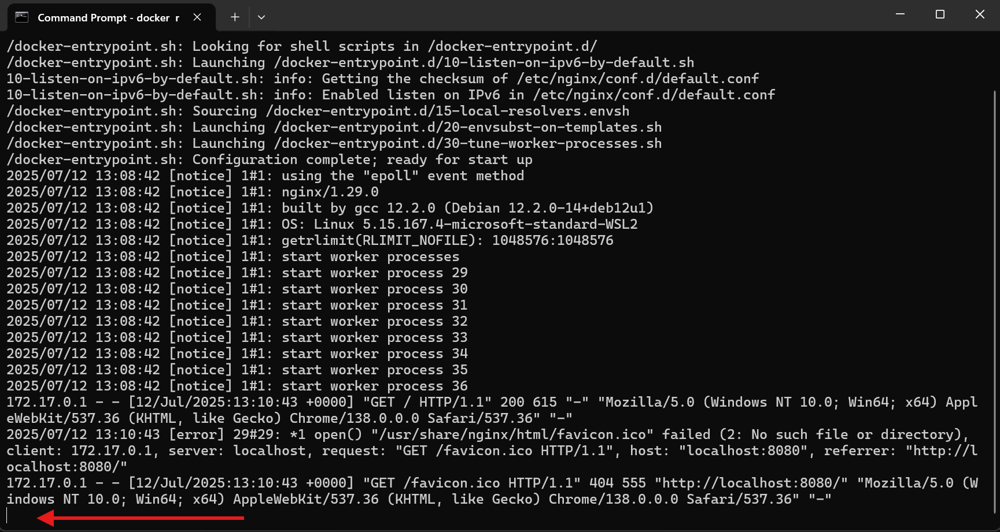

Nach dem Start wird sofort die `nginx`-Logausgabe angezeigt und das Terminal wartet. Man kann den Container dann mit `STRG + C` schnell beenden.
Wenn man möchte, dass der Container im Hintergrund läuft und das Terminal sofort wieder verfügbar ist, kann man den sogenannten Detached Mode aktivieren. Das geschieht mit dem Flag `-d`:

```
docker run -d -p 8080:80 nginx
```

Der Container wird hier wie gewohnt gestartet, aber er läuft jetzt im Hintergrund. Das Terminal steht direkt für neue Befehle zur Verfügung. Außerdem wird im Terminal noch eine sogenannte Container-ID ausgegeben:

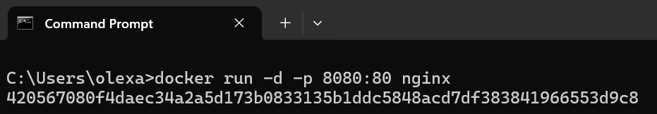

Diese lange Zeichenkette ist die ID des gestarteten Containers. Diese ID kann genutzt werden um mit dem Container zu interagieren. Wenn man `docker ps` ausführt, sieht man genau dieselbe ID in der Spalte "Container ID":

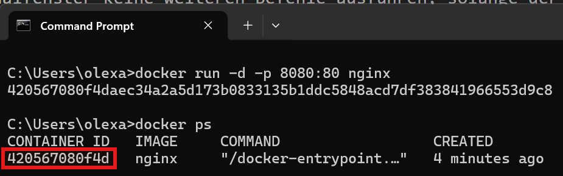

Man muss aber nicht unbedingt die Container-ID nutzen, man kann auch den zufällig erstellten Namen verwenden:

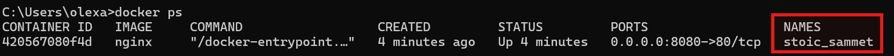

Diesen Namen können wir beim Start des Containers selber festlegen, dazu gibt man den `--name`-Flag mit. Vorher muss man natürlich den Container beenden, da der Port 8080 bereits verwendet wird, dadurch wird er wieder frei:

```
docker run -d -p 8080:80 --name my-nginx nginx
```

Man sieht auch in Docker Desktop unter "Containers", alle bisherigen Containers:

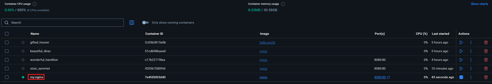

Mithilfe der Container-ID oder des Namens, können wir z.B. die Logs des container ansehen:

```
docker logs my-nginx
```

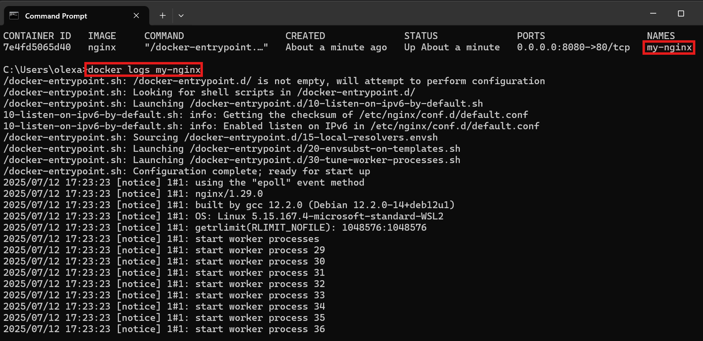

Oder man klickt in Docker Desktop auf den jeweiligen Container, da sieht man ebenfalls die Logs:

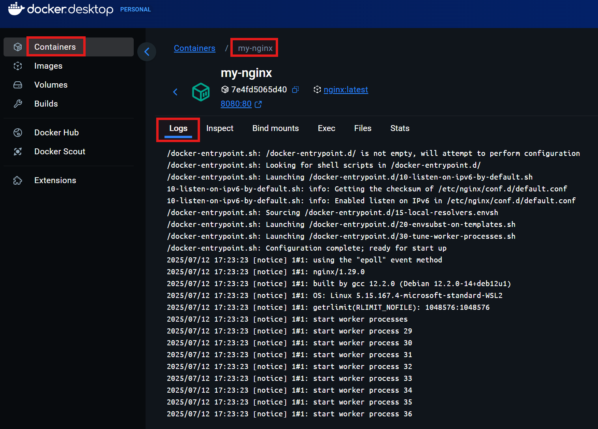

Man sieht hier auch direkt, dass man in der Lage ist, den Container innerhalb der GUI zu stoppen oder auszuführen:

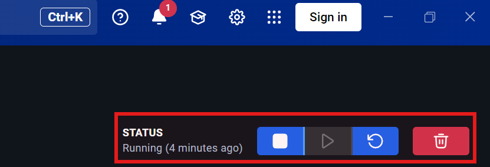

Zum Stoppen des Container, nutzt man im Terminal in den meisten Fällen, folgenden Befehl:

```
docker stop my-nginx
```

In den Logs des gestoppten Container müsste in etwa `worker process.... exited with code....` stehen. Auch der grüne Punkt in der Gui, neben dem Container, ist verschwunden:

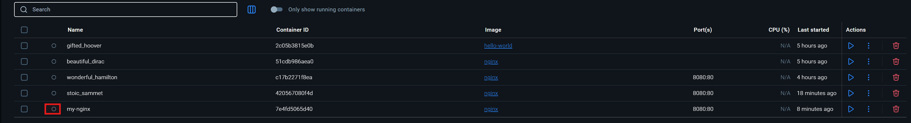

Wir bereits bemerkt, werden die Container nach dem Stoppen nicht gelöscht. Falls man alle gestoppten Container dauerhaft enrfernen möchte, kann man es über die GUI machen oder direkt im Terminal mit:

```
docker container prune
```

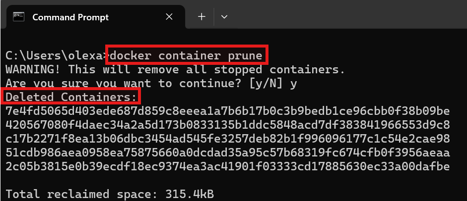

Wenn man mit Docker häufig arbeitet, wird man feststellen dass man früher oder später viele ungenutzte Container hat. Um genau dieses Problem zu vermeiden, gibt es den `--rm`-Flag. Dadurch wird der Container automatisch gelöscht, sobald er beendet wird:

```
docker run -d -p 8080:80 --name my-nginx --rm nginx
```

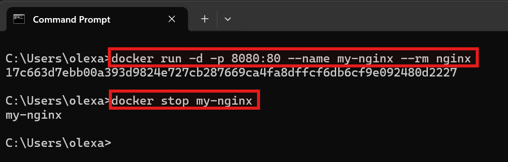

Nach dem Stoppen des Container ist er im Docker Desktop, wegen `--rm`, nicht mehr vorhanden.

