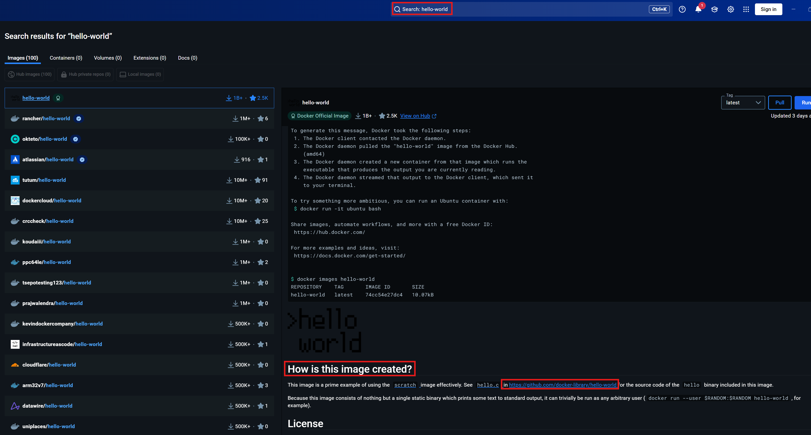
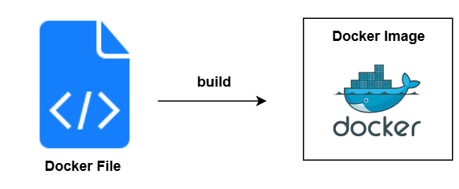
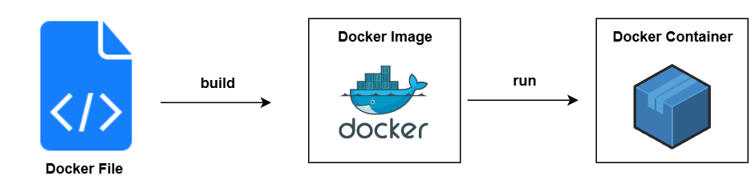
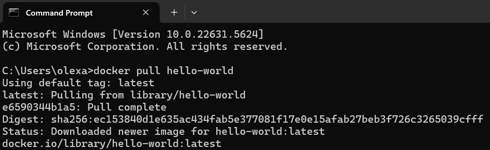
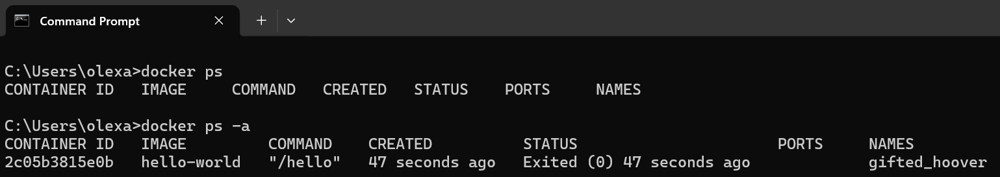

# Container vs. Images

Betrachten wir nun näher den Unterschied zwischen einem Docker Image und einem Container.

## 1. Was ist ein Docker Image?

Ein Docker Image ist eine unveränderbare (schreibgeschützte) Datei, die als Vorlage dient, um daraus einen oder mehrere Container zu erstellen. Es enthält alles, was eine Anwendung benötigt, um lauffähig zu sein – unabhängig von der Umgebung, in der sie gestartet wird.
<br>
<br>
Das Ziel eines Docker Images ist es, eine vollständig reproduzierbare und portable Laufzeitumgebung bereitzustellen.
<br>
<br>
Ein Image enthält typischerweise:

- **Den Anwendungscode:**<br>
  Also das eigentliche Programm oder die Skripte, die ausgeführt werden sollen.

- **Alle Abhängigkeiten**<br>
  Zum Beispiel Python, Node.js oder Java – je nachdem, womit die Anwendung entwickelt wurde.

- **Systemwerkzeuge und Konfigurationen:**<br>
  Dazu gehören Hilfsprogramme, Paketmanager oder notwendige Linux-Befehle.

- **Umgebungsvariablen und Standardpfade:**<br>
  Damit die Anwendung weiß, wo bestimmte Daten liegen oder wie sie sich verhalten soll.

- **Einen Startbefehl:**<br>
  Dieser wird automatisch ausgeführt, wenn das Image als Container gestartet wird.

Ein Docker Image wird in der Regel durch eine Dockerfile erstellt. Das ist eine einfache Textdatei, in der man Schritt für Schritt angibt, wie das Image aufgebaut sein soll.
<br>
<br>
Das offizielle `hello-world` Image ist ein sehr einfaches Testprogramm. Es gibt beim Starten eine kurze Bestätigung aus, dass Docker richtig funktioniert. Man kann sich den Aufbau dieses Images etwa so vorstellen:

```dockerfile
# 1. Nutze ein sehr kleines Linux-Basis-Image:
FROM scratch

# 2. Füge die kompilierten Ausgabedateien hinzu (nur eine Binary-Datei):
ADD hello /hello

# 3. Definiere, welcher Befehl beim Start des Containers ausgeführt wird:
CMD ["/hello"]
```

Wenn man über den Dockerfile, vom `hello-world` Image, mehr erfahren möchte, dann kann man dies unter Docker Desktop tun:



In den meisten Fällen, möchte man sich als Nutzer oder Entwickler nicht direkt mit der Dockerfile beschäftigen. Häufig verwendet man fertige Images, womit man Container erstellt und mit denen dann arbeitet. Sobald man aber ernsthaft mit Docker entwickeln, anpassen oder veröffentlichen will, kommt man an der Dockerfile nicht vorbei. Also reicht für uns erstmal einfach nur aus zu Wissen, was ein Dockerfile grob ist.



## 2. Was ist ein Docker Container?

Ein Docker Container ist eine laufende oder gestoppte Instanz eines Docker Images. Man kann sich einen Container als eine Art "lebendige Kopie" eines Images vorstellen – also ein aktiver Prozess, der auf dem Image basiert und damit arbeitet. Während das Image die Vorlage bzw. der Bauplan ist, ist der Container die ausgeführte Anwendung.
<br>
<br>
Der Begriff „Container“ kommt ursprünglich aus der Logistik:
Ein Schiffscontainer hat immer die gleiche Form, aber man kann beliebige Inhalte hineinpacken – von Autos bis Bananen.
Egal welcher Hafen oder welches Schiff: Der Container wird überall gleich behandelt. Genauso funktioniert ein Docker Container:

- Man kann verschiedene Anwendungen verpacken (z. B. Python-Skript, Webserver, Datenbank).

- Aber nach außen sehen alle Container gleich aus – sie lassen sich standardisiert starten, stoppen, verschieben und verwalten.

Somit können wir das Bild vom Docker File über Docker Image bis zum Docker Container vervollständigen:



Um sich schnell ein Docker Image im Terminal zu holen, verwendet man den Befehl:

```
docker pull <image-name>
```

Wir können z.B. nochmal das `hello-world` Image downloaden:

```
docker pull hello-world
```




Wir können mithilfe des folgenden Befehls alle Images, welche lokal vorhanden sind, anzeigen lassen:

```
docker image ls
```

Man kann sich sehr schnell einen Überblick über die laufenden Container auf dem System verschaffen:

```
docker ps
```

Standardmäßig zeigt `docker ps` nur die laufenden Container an. Wir erzeugen mit `docker run hello-world` einen neuen Container, welcher gestartet wird, seine Aufgabe erfüllt und am ende beendet wird. Nun hätten wir einen gestoppten Container welcher durch `docker ps` nicht angezeigt wird. Wenn man auch gestoppte Container sehen möchte, muss man den Befehl so erweitern:

```
docker ps -a
```




## 3. Zusammenfassung

| **Aspekt**                  | **Docker Image**                                                     | **Docker Container**                                                     |
| --------------------------- | -------------------------------------------------------------------- | ------------------------------------------------------------------------ |
| **Definition**              | Eine schreibgeschützte Vorlage mit allem, was eine Anwendung braucht | Eine laufende oder gestoppte Instanz eines Images                        |
| **Zustand**                 | Statisch, unveränderlich                                             | Dynamisch, ausführbar, veränderlich                                      |
| **Bestandteile**            | Anwendungscode, Bibliotheken, Konfigurationen, Startbefehl           | Enthält alle Inhalte des Images + laufende Prozesse und evtl. Änderungen |
| **Funktion**                | Dient als Vorlage zur Erstellung von Containern                      | Führt die Anwendung aus                                                  |
| **Speicherort**             | Auf dem System gespeichert als Datei/Schicht (Layer)                 | Läuft als isolierter Prozess im RAM                                      |
| **Erstellung**              | Über `docker build` oder durch Herunterladen (`docker pull`)         | Durch Ausführen eines Images: `docker run <image>`                       |
| **Startbefehl**             | Wird im Image festgelegt (CMD oder ENTRYPOINT)                       | Wird beim Start ausgeführt                                               |
| **Verhalten**               | Unveränderlich – immer gleich                                        | Kann Daten speichern, Logs erzeugen, interaktiv arbeiten                 |
| **Mehrfach verwendbar**     | Ja, aus einem Image können beliebig viele Container erstellt werden  | Ja, aber jeder Container ist eine eigene Instanz                         |
| **Beispiel**                | `hello-world:latest`                                                 | `hopeful_morse` (automatisch benannter Container)                        |
| **Sichtbar mit Docker CLI** | `docker image ls`                                                    | `docker ps -a`                                                           |
| **Löschbar mit**            | `docker rmi <image>` (nur wenn kein Container es verwendet)          | `docker rm <container>`                                                  |

