# Eigene Docker-Images erstellen

In den vorherigen Kapiteln wurde erläutert, wie man bestehende Images aus dem Docker Hub verwendet, wie man Container startet und wie man mit Volumes arbeitet. Nun geht es einen Schritt weiter, eigene Docker-Images erstellen. In vielen Fällen reicht es aus, ein bereits vorhandenes Docker-Image zu verwenden – zum Beispiel ein Image mit einer fertigen Webserver-Software wie Nginx oder ein Image mit der Programmiersprache Python. Diese Images findet man in der Regel auf Docker Hub, der großen öffentlichen Sammlung von Images. Aber manchmal braucht man etwas Individuelles – etwas, das genau zu den eigenen Anforderungen passt. In solchen Fällen ist es sinnvoll oder sogar notwendig, ein eigenes Docker-Image zu bauen.
<br>
<br>
Wir hatten ja bereits erfahren, dass ein Docker-Image eine Art Schablone für Container ist. Ein Container ist dann eine laufende Instanz eines Images. Man kann sich ein Image also wie ein Installationspaket und den Container wie die tatsächlich installierte und laufende Anwendung vorstellen.
<br>
<br>
Das Dockerfile ist die zentrale Datei zum Bau eines Docker-Images. Es enthält Schritt-für-Schritt-Anweisungen, wie das Image erstellt werden soll. Wir betrachten dazu ein Beispiel:

- Stellt euch vor, ihr entwickelst eine eigene Website oder ein kleines Webprojekt mit HTML, CSS und JavaScript.

- Man möchtet diese Seite mit dem Webserver Nginx ausliefern.

- Das Standard-Image von Nginx zeigt aber nur eine Beispielseite.

- Damit unsere eigene Seite angezeigt wird, muss man ein Image erstellen, in dem dein HTML-Code enthalten ist.

Statt der Nginx-Standardseite soll auf `localhost` eine To-Do-Liste im Browser angezeigt werden. Dafür benötigt man ein eigenes Image, das genau diesen HTML-Code enthält. Wir erstellen einen neuen Ordner `MySite` und öffnen ihn in VS Code. Außerdem erstellen wir unter `MySite` noch einen weiteren Ordner mit der Bezeichnung `frontend`. Innerhalb von `frontend` liegt der Dockerfile:

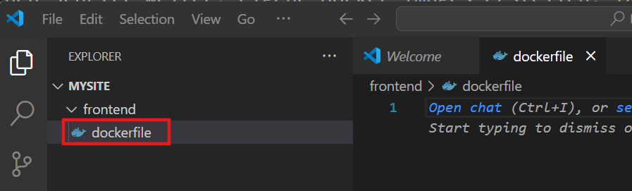

Außerdem installieren wir noch die Docker Extension, damit wir die Autovervollständigung und weitere nützliche Funktionalitäten erhalten:

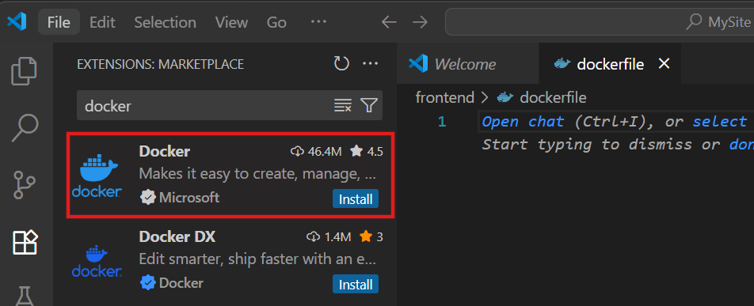

Man erstellt in fast allen Fällen nicht von Null aus ein Dockerfile, sodnern baut auf anderen Docker-Images auf. Wir schreiben in die `dockerfile`:

```dockerfile
FROM nginx
```

Die erste Zeile ist der erste und wichtigste Befehl in einem Dockerfile. Sie sagt Docker:
"Verwende das fertige Nginx-Image in der Version 1.27.0 als Ausgangsbasis für mein eigenes Image."

Nun können wir in den `frontend`-Ordner navigieren:

```
cd frontend
```

Nun erstellen wir ein neues Image, basierend auf dem `dockerfile` im aktuellen Verzeichnis und geben ihm den Namen `mysite`:

```
docker build -t mysite .
```

- `-t` steht für "tag", also Etikett oder Bezeichner, dieser Name hilft später dabei, das Image zu starten oder es weiterzugeben.

- Der Punkt `.` gibt an, welches Verzeichnis als sogenannter Build-Kontext verwendet werden soll. Das bedeutet, Docker schaut in diesem Verzeichnis nach dem Dockerfile und hat nur Zugriff auf Dateien in diesem Ordner (und Unterordner). Docker hat beim Bauen nur Zugriff auf Dateien innerhalb des angegebenen Kontextes – also nicht auf übergeordnete Ordner!

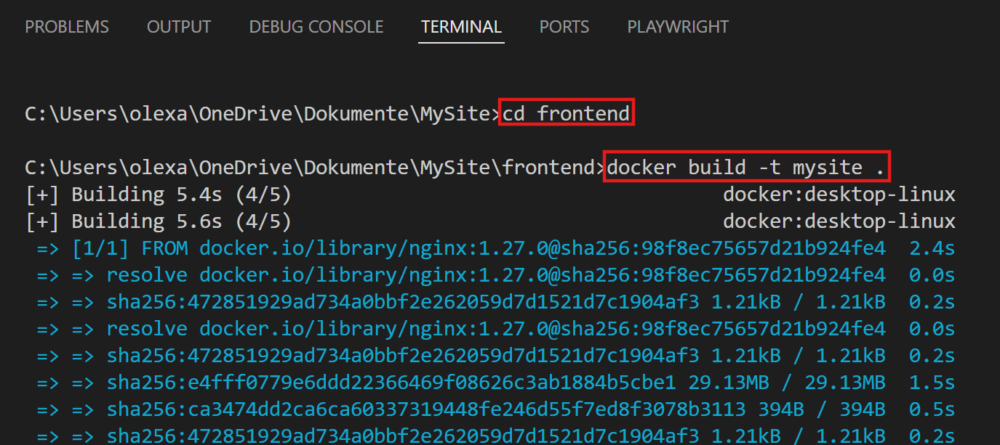

Nun sollte unser Image mit dem Namen `mysite` in Docker Desktop sichtbar sein:

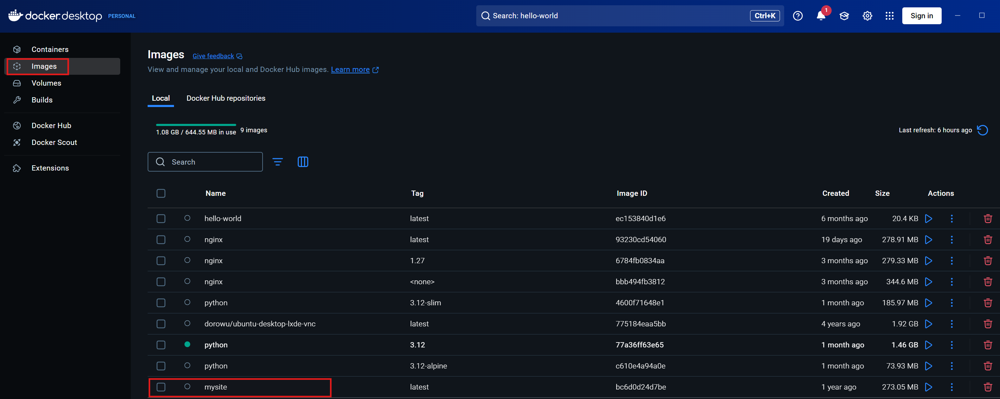

Wir können ihn ausführen, aber momentan ist es nichts weiter als eine Kopie vom `nginx`-Image. Wir werden nun weiter unser `dockerfile` anpassen. Dazu erstellen wir unter dem `frontend`-Ordner einen `static`-Ordner mit einer html-Datei, welche den Namen `index.html` hat:

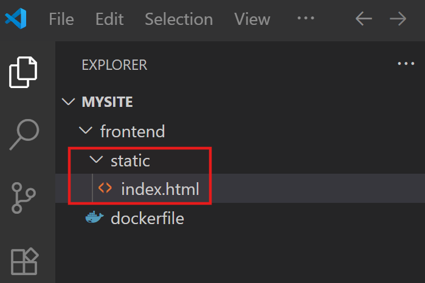

**index.html:**

```html
<!DOCTYPE html>
<html lang="en">
<head>
  <meta charset="UTF-8" />
  <meta name="viewport" content="width=device-width, initial-scale=1.0"/>
  <title>Frontend-only Todo List</title>
</head>
<body>
  <h1>Todo List</h1>
  <input type="text" id="newItem" placeholder="Enter a new item" />
  <button onclick="addItem()">Add</button>
  <ul id="todoList"></ul>

  <script>
    // In-Memory-Speicher für unsere Aufgaben
    let todos = [];

    function renderTodos() {
      const list = document.getElementById('todoList');
      list.innerHTML = '';
      todos.forEach((todo, index) => {
        const li = document.createElement('li');
        li.textContent = todo;
        
        const deleteBtn = document.createElement('button');
        deleteBtn.textContent = 'Delete';
        deleteBtn.onclick = () => {
          todos.splice(index, 1);
          renderTodos();
        };
        
        li.appendChild(deleteBtn);
        list.appendChild(li);
      });
    }

    function addItem() {
      const input = document.getElementById('newItem');
      const value = input.value.trim();
      if (value !== '') {
        todos.push(value);
        input.value = '';
        renderTodos();
      }
    }

    // Initialanzeige
    renderTodos();
  </script>
</body>
</html>
```

Bisher enthält unser Docker-Image nur den standardmäßigen HTML-Inhalt von Nginx. Nun wollen wir diesen durch unsere eigene Datei `index.html` ersetzen. Dafür müssen wir unsere HTML-Datei in den richtigen Ort innerhalb des Images kopieren – dorthin, wo Nginx nach statischen Inhalten sucht. Der Ort, an dem Nginx standardmäßig HTML-Dateien erwartet, ist:

```
/usr/share/nginx/html
```

Daher passen wir unseren `dockerfile` an:

```
COPY static /usr/share/nginx/html
```

Da sich unser Dockerfile verändert hat, müssen wir das Image neu bauen:

```
docker build -t mysite .
```

In Docker Desktop sollte man sehen dass kürzlich unser Image erstellt wurde:

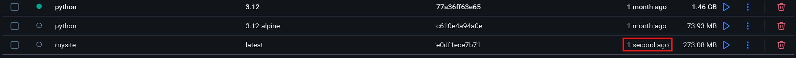

Jetzt wollen wir unser eigenes Image testen. Dafür starten wir einen Container und veröffentlichen den Port 80 auf unserem lokalen Rechner:

```
docker run -p 80:80 mysite
```

Der Container startet Nginx – und der Nginx-Server zeigt jetzt unsere eigene To-Do-Liste im Browser an. Dazu öffnen wir auf unserem Computer `http://localhost`

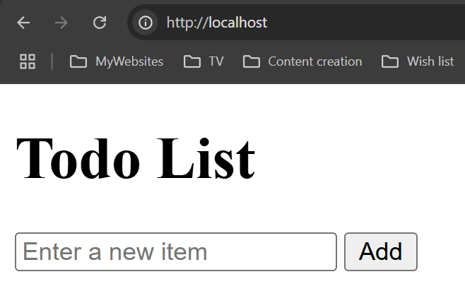

Es ist momentan eine reine Frontend-Anwendung, man sollte auch Todo-Items hinzufügen können:

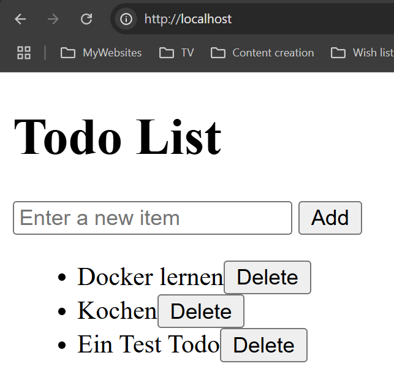

Wir könnten nun prüfen ob im Container die `index.html`-Datei wirklich hinterlegt wurde. In Docker Desktop gehen wir unter "Containers" auf den momentan ausgeführten Container, mit dem Image `mysite`:

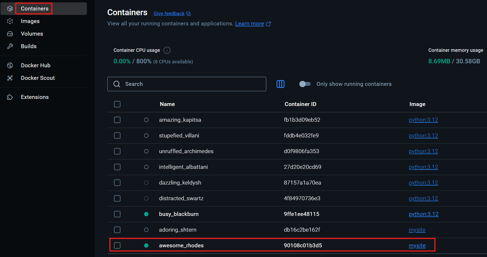

Wenn wir in der Container-UI sind, klicken wir noch auf "Exec":

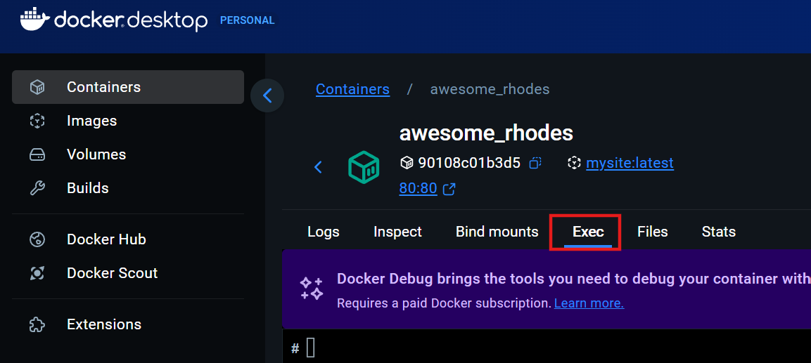

Jetzt geben wir ein:

```
cd /usr/share/nginx/html
ls
```

Hier sollte man die `index.html`-Datei sehen:

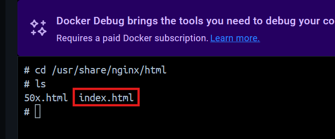

Wir können auch den Inhalt der Datei anschauen:

```
cat index.html
```

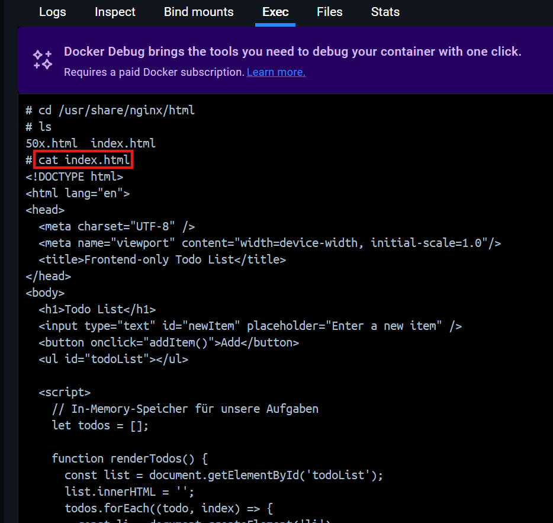

In dem Verzeichnis ist nicht nur unsere `index.html` Datei vorhanden, sondern noch eine `50x.html`-Datei, welche welche von Nginx als Standard-Fehlermeldungsseite für Serverfehler (z.B. "500 Internal Server Error") verwendet wird. Diese Datei stammt aus dem ursprünglichen Nginx-Image und wird automatisch mitgeliefert. Wir möchten dass diese Datei nicht vorhanden ist, dazu erweitern wir unser `dockerfile`:

**dockerfile:**
```dockerfile
FROM nginx:1.27.0

# Webverzeichnis html löschen:
RUN rm -rf /usr/share/nginx/html

# Eigene HTML-Dateien hinzufügen
COPY static /usr/share/nginx/html
```

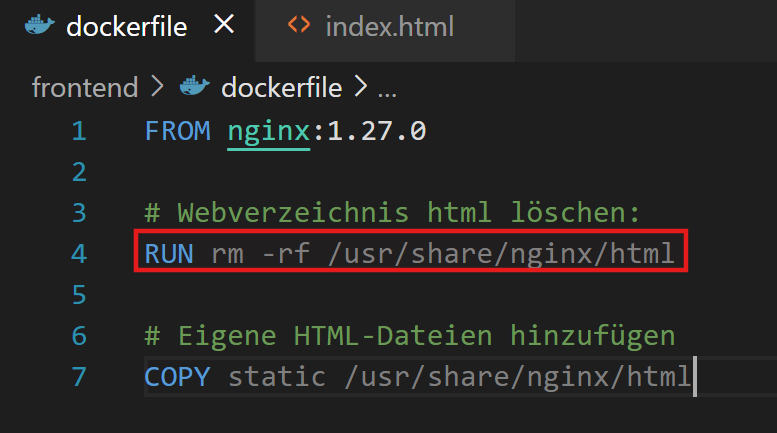

Da sich unser Dockerfile verändert hat, müssen wir das Image neu bauen:

```
docker build -t mysite .
```

Jetzt wollen wir wieder unser eigenes Image testen. Dafür starten wir einen Container:

```
docker run -p 80:80 mysite
```

Unsere Todo List unter `http://localhost` sollte weiterhin ohne Probleme funktionieren. Jetzt müsste aber NUR die Datei `index.html` vorhanden sein, das Testen wir durch:

```
cd /usr/share/nginx/html
ls
```

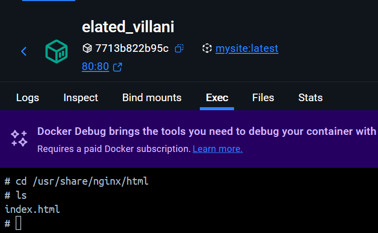

Nun haben wir gelernt, wie man ein eigenes Docker-Image erstellt und darin eine statische Website mit Nginx bereitstellt. Am Ende haben wir ein vollständiges Docker-Image gebaut, das eine funktionierende To-Do-Liste im Browser darstellt – und das ganz ohne Backend, rein im Frontend mit JavaScript.


## Übungsaufgabe: Dockerfile-Befehle zuordnen

{{ task(file="tasks/02_00_04.yaml") }}
