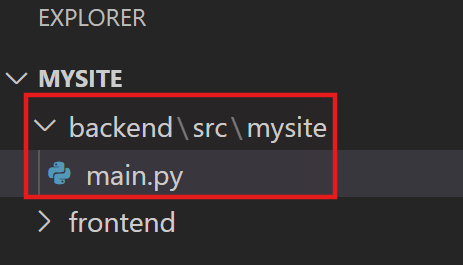
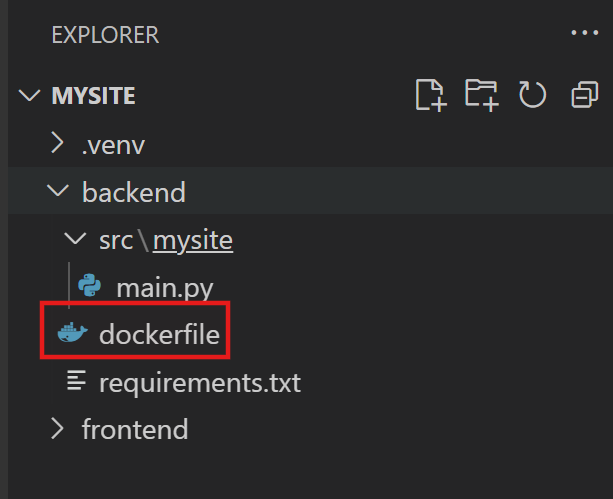
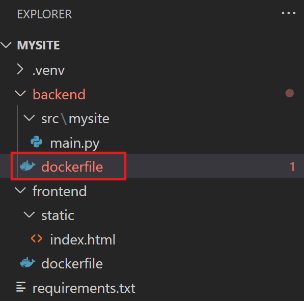
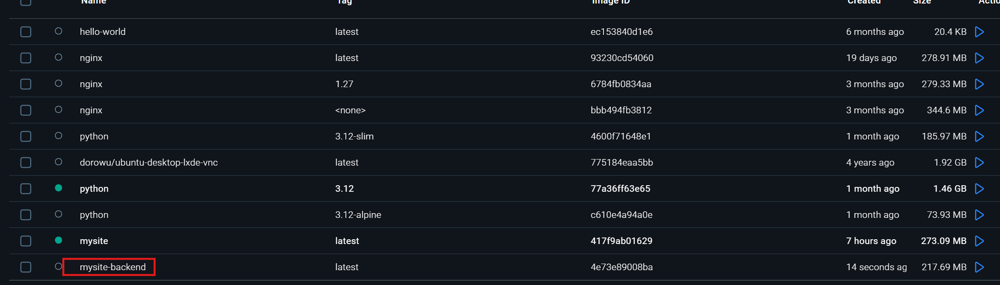
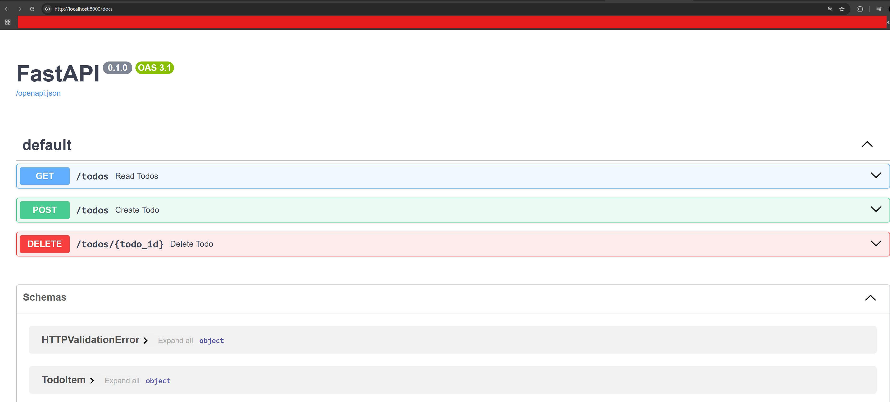
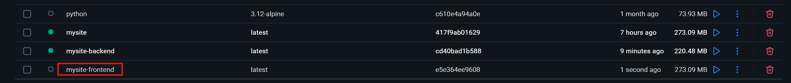
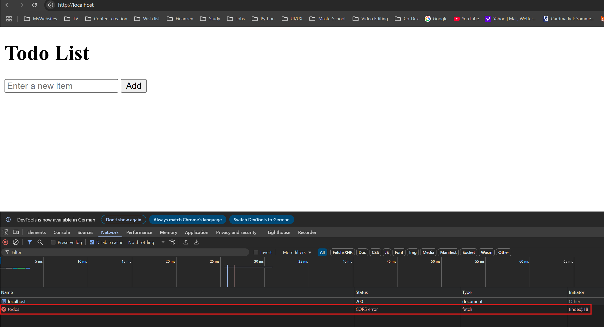
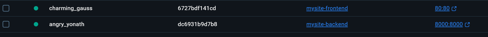
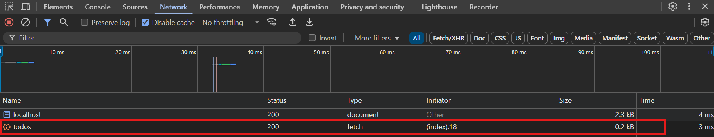
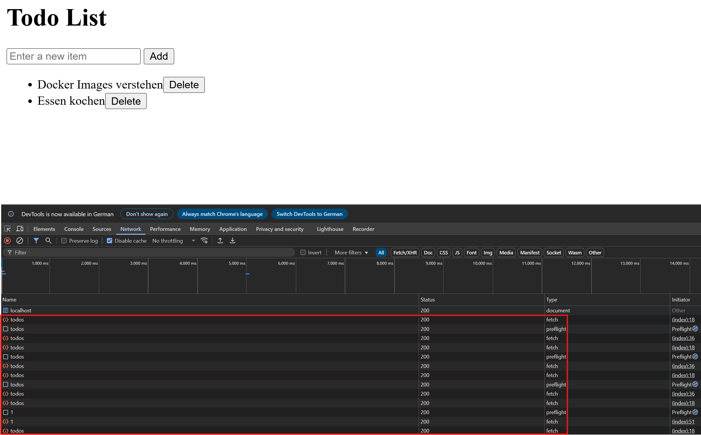

# Eigene Docker-Images erstellen - Erweitert

Kehren wir zurücl zu unserer Anwendung mit der Todo-Liste zurück. Wir hatten bereits das Frontend erstellt und ein `dockerfile`. Wir werden diese Anwendung mit einem Fast-API Backend erweitern. Wir erweitern nun unser Projektverzeichnis mit der folgenden Struktur:



Außerdem wird noch eine virtuelle Entwicklungsumgebung `.venv` benötigt. Im Terminal geben wir ein:

Ordner `.venv` erstellen:
```
\MySite>python -m venv .venv
```

Viruelle Entwicklungsumgebung aktivieren:
```
\MySite>.venv\Scripts\activate
```

Mit `CTRL + SHIFT + P` öfnnen wir in VS-Code "Command Palatre", wählen "Python: Select Interpreter" aus und wechselt zum `.venv` wo "Recommended" steht:



Nun installieren wir FastAPI:
```
\MySite>pip install fastapi
```

Auch der Server für FastAPI, muss installiert werden:
```
\MySite>pip install uvicorn
```

Außerdem erstellen wir noch eine `requirements.txt`-Datei direkt im `backend`-Ordner:
```
\MySite>pip freeze > requirements.txt
```

In die `main.py` Datei fügen wir den folgenden Code ein:

```python
# Importieren der Hauptklasse um die Webanwendung zu erstellen und eine Klasse zur kontrollierten Bhandlung von Fehlermeldungen:
from fastapi import FastAPI, HTTPException
# Basis für die Datenmodelle (Validierung):
from pydantic import BaseModel

# Der Einstiegspunkt:
app = FastAPI()

# Beschreibt ein vollständiges To-do-Objekt mit ID und Inhalt:
class TodoItem(BaseModel):
    id: int
    content: str

# beschreibt nur den Inhalt eines neuen To-do:
class TodoItemCreate(BaseModel):
    content: str

# Eine einfache Python-Liste, die alle Aufgaben enthält:
todos: list[TodoItem] = []
# Eine Zählvariable, um jedem Todo eine eindeutige ID zu geben:
id_counter = 1

@app.post("/todos", response_model=TodoItem)
async def create_todo(item: TodoItemCreate):
    global id_counter
    new_todo = TodoItem(id=id_counter, content=item.content)
    todos.append(new_todo)
    return new_todo

@app.get("/todos", response_model=list[TodoItem])
async def read_todos():
   return todos

@app.delete("/todos/{todo_id}")
async def delete_todo(todo_id: int):
    for index, todo in enumerate(todos):
        if todo.id == todo_id:
            todos.pop(index)
            return {"message": "Todo deleted successfully"}
    raise HTTPException(status_code=404, detail="Todo not found")
```

Direkt im `backend`-Ordner erstellen wir eine `dockerfile`-Datei:



Der Inhalt ist in dieser Datei:

**dockerfile im backend:**
```dockerfile
FROM python:3.12-slim

# Setzt das Arbeitsverzeichnis im Container:
WORKDIR /app

# Kopiert die Datei "requirements.txt" aus dem aktuellen Projektordner in den Container:
COPY requirements.txt requirements.txt

# Pakete aus "requirements.txt" installieren:
RUN pip install --no-cache-dir -r requirements.txt

# Code der Anwendung wird kopiert in "/app/mysite":
COPY src/mysite mysite

# Für Dokumentation,der Container "hört" auf Port 8000 (Standard-Port für FastAPI mit Uvicorn):
EXPOSE 8000

# Startbefehl für den Container:
CMD [ "uvicorn", "mysite.main:app", "--host", "0.0.0.0", "--port", "8000" ]
```

Nun ist es an der Zeit, das Docker-Image zu bauen. Dazu wechseln wir im Terminal in den `backend`-Ordner und führen folgenden Befehl aus:

```
docker build -t mysite-backend .
```

In Docker Desktop sollte nun das neue Image erscheinen:



Nun starten wir den Container, mithilfe dieses Images:

```
docker run -p 8000:8000 mysite-backend
```

Jetzt kann man wie gewohnt über `http://localhost:8000/docs` die interaktive Swagger-UI Dokumentationsseite von FastAPI besuchen:



Jetzt muss im Frontend die `index.html`-Datei angepasst werden, damit wird mit dem Backend interagieren können. Dazu soll die `index.html`-Datei mit dem folgenden code ersetzt werden:

```html
<!DOCTYPE html>
<html lang="en">
<head>
    <meta charset="UTF-8">
    <meta name="viewport" content="width=device-width, initial-scale=1.0">
    <title>Minimal Todo List</title>
</head>
<body>
    <h1>Todo List</h1>
    <input type="text" id="newItem" placeholder="Enter a new item">
    <button onclick="addItem()">Add</button>
    <ul id="todoList"></ul>

    <script>
        const API_URL = 'http://localhost:8000';

        async function fetchTodos() {
            const response = await fetch(`${API_URL}/todos`);
            const todos = await response.json();
            const list = document.getElementById('todoList');
            list.innerHTML = '';
            todos.forEach(todo => {
                const li = document.createElement('li');
                li.textContent = todo.content;
                const deleteBtn = document.createElement('button');
                deleteBtn.textContent = 'Delete';
                deleteBtn.onclick = () => deleteItem(todo.id);
                li.appendChild(deleteBtn);
                list.appendChild(li);
            });
        }

        async function addItem() {
            const input = document.getElementById('newItem');
            if (input.value.trim() !== '') {
                const response = await fetch(`${API_URL}/todos`, {
                    method: 'POST',
                    headers: {
                        'Content-Type': 'application/json',
                    },
                    body: JSON.stringify({ content: input.value }),
                });
                if (response.ok) {
                    input.value = '';
                    fetchTodos();
                }
            }
        }

        async function deleteItem(id) {
            const response = await fetch(`${API_URL}/todos/${id}`, {
                method: 'DELETE',
            });
            if (response.ok) {
                fetchTodos();
            }
        }

        fetchTodos();
    </script>
</body>
</html>
```

Nun muss natürlich ein neues Image für das Frontend erstellt werden. Dazu wechseln wir in einem neuen Terminal in das `frontend`-Verzeichnis und führen folgenden Befehl aus:

```
docker build -t mysite-frontend .
```

In Docker Desktop müsste nun das `mysite-frontend`-Image sichtbar sein:



Jetzt führen wir auch den Container für das Frontend aus:

```
docker run -p 80:80 -d mysite-frontend
```

Die FastAPi Swagger-UI Seite ist immer noch erreichbar unter http://localhost:8000/docs und jetzt auch das Frontend unter http://localhost/. Im Frontend öffne ich die DevTools, gehe zu "Network" und lade die Seite neu:



Hier sieht man den sogenannten CORS-Fehler. Ein CORS-Fehler (Cross-Origin Resource Sharing) bedeutet, dass unser Frontend `http://localhost/` versucht, mit dem Backend `http://localhost:8000/docs`  zu kommunizieren, aber der Browser die Verbindung blockiert, weil das Backend nicht explizit erlaubt, von einer anderen Domain aus angesprochen zu werden.
<br>
<br>

CORS ist ein Sicherheitsmechanismus im Browser, der verhindert, dass Webseiten aus einer anderen Quelle (Origin) unkontrolliert auf Ressourcen zugreifen. Dabei handelt es sich um ein Standardverhalten von Browsern. Damit das Backend solche Anfragen erlaubt, muss man CORS freischalten – das geht mit der sogenannten `CORSMiddleware`. Nach der Anpassung sieht die `main.py`-Datei so aus:

```python
# Importieren der Hauptklasse um die Webanwendung zu erstellen und eine Klasse zur kontrollierten Bhandlung von Fehlermeldungen:
from fastapi import FastAPI, HTTPException
# Basis für die Datenmodelle (Validierung):
from pydantic import BaseModel
# CORS-Middleware importieren, um CORS-Fehler zu beheben:
from fastapi.middleware.cors import CORSMiddleware  

# Der Einstiegspunkt:
app = FastAPI()

# CORS zulassen:
app.add_middleware(
    CORSMiddleware,
    allow_origins=["http://localhost"],  # Hier die URL des Frontends
    allow_credentials=True,
    allow_methods=["*"],
    allow_headers=["*"],
)

# Beschreibt ein vollständiges To-do-Objekt mit ID und Inhalt:
class TodoItem(BaseModel):
    id: int
    content: str

# beschreibt nur den Inhalt eines neuen To-do:
class TodoItemCreate(BaseModel):
    content: str

# Eine einfache Python-Liste, die alle Aufgaben enthält:
todos: list[TodoItem] = []
# Eine Zählvariable, um jedem Todo eine eindeutige ID zu geben:
id_counter = 1

@app.post("/todos", response_model=TodoItem)
async def create_todo(item: TodoItemCreate):
    global id_counter
    new_todo = TodoItem(id=id_counter, content=item.content)
    todos.append(new_todo)
    return new_todo

@app.get("/todos", response_model=list[TodoItem])
async def read_todos():
   return todos

@app.delete("/todos/{todo_id}")
async def delete_todo(todo_id: int):
    for index, todo in enumerate(todos):
        if todo.id == todo_id:
            todos.pop(index)
            return {"message": "Todo deleted successfully"}
    raise HTTPException(status_code=404, detail="Todo not found")
```

Nun müssen wir nochmal in das `backend`-Verzeichnis wechseln und einen neuen Docker-Image erstellen:

```
docker build -t mysite-backend .
```

Nun starten wir den Container, mithilfe dieses Images:

```
docker run -p 8000:8000 mysite-backend
```

Jetzt sind die beiden Container für das Frontend und Backend aktiv:



Wenn wir nochmal das Frontend aufrufen, sollte der CORS-Fehler verschwinden:



Man kann jetzt die Todos hinzufügen und unter "Networks" in den Dev-Tools beobachten wie das Frontend mit dem Backend kommuniziert:



## Fazit

In diesem Kapitel wurde Schritt für Schritt gezeigt, wie man eine vollständige Webanwendung mit Frontend und einem FastAPI-Backend in separaten Docker-Containern betreiben kann. Dabei lag der Schwerpunkt auf einer praxisnahen Umsetzung: vom Einrichten der Verzeichnisstruktur über das Erstellen eigener Dockerfiles bis hin zur Bewältigung realer Herausforderungen – etwa CORS-Fehlern, die bei der Kommunikation zwischen verschiedenen Containern auftreten können.
<br>
<br>
Ein zentrales Prinzip von Docker ist die Trennung von Anwendungscode und Laufzeitumgebung. Durch das Erstellen eines eigenen Dockerfiles für das Backend und später auch für das Frontend wurde deutlich:

- Jede Anwendung läuft isoliert in ihrem eigenen Container, unabhängig von anderen Komponenten.

- Alle Abhängigkeiten, Konfigurationen und Installationen sind im Container selbst enthalten – es wird nichts vom Host-System benötigt.

- Dadurch lässt sich die Anwendung plattformunabhängig betreiben – egal ob auf Windows, macOS oder Linux.

Ein weiteres zentrales Lernziel war das Verständnis für den Aufbau eines Dockerfiles: Es beschreibt präzise, wie ein Docker-Image zusammengesetzt ist – von der Basis über die Paketinstallation bis hin zum Startbefehl. Damit wird deutlich, wie man Anwendungen sauber paketiert, automatisiert ausliefert und in reproduzierbaren Umgebungen betreibt.

