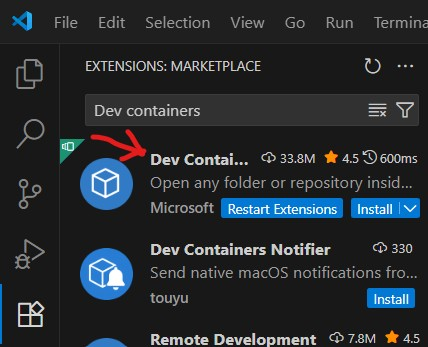
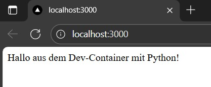
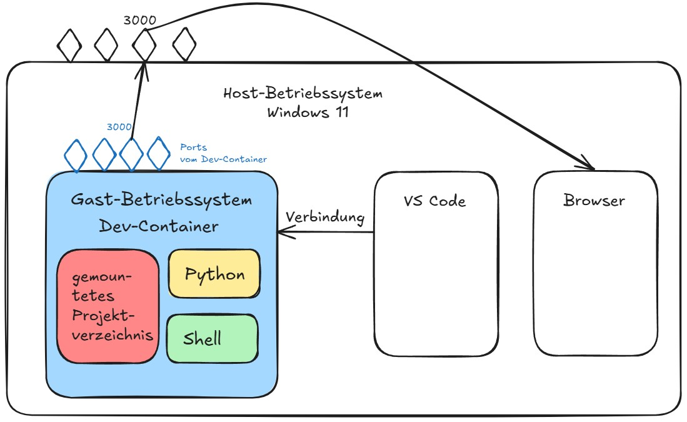

# Dev-Container

Dev-Container sind eine spezielle Art von Container. Ein solcher enthält nicht nur die App, sondern die gesamte Entwicklungsumgebung:

* Betriebssystem-Tools (z. B. Git, curl, make)

* Programmiersprachen & Compiler

* Build-Tools und Debugger

* Editor-Plugins, Formatierer, Linter

* Zugriff auf Quellcode, Git, Terminal etc.

**Ziel:** Entwickler arbeiten direkt innerhalb eines Containers. Im besten Fall bietet er die gleiche Umgebung, wie die spätere Produktionsumgebung.


**Beispiel:** Dev-Container für eine Flask App mit Python Umgebung und Installation der requirements

```title="Devcontainer.json"
// For format details, see https://aka.ms/devcontainer.json. For config options, see the
// README at: https://github.com/devcontainers/templates/tree/main/src/python
{
    "name": "Python 3",
    "image": "mcr.microsoft.com/devcontainers/python:1-3.12-bullseye",

    // Features of the devcontainer. More info: https://containers.dev/features.
    // "features": {},

    // Use 'forwardPorts' to make a list of ports inside the container available locally.
    "forwardPorts": [3000],

    // Use 'postCreateCommand' to run commands after the container is created.
    "postCreateCommand": "pip3 install --user -r requirements.txt"

    // Configure tool-specific properties.
    // "customizations": {},

    // Uncomment to connect as root instead. More info: https://aka.ms/dev-containers-non-root.
    // "remoteUser": "root"
}
```

```title="Requirements.txt"
flask
```

```python title="app.py"
from flask import Flask

app = Flask(__name__)

@app.route("/")
def home():
    return "Hallo aus dem Dev-Container mit Python!"

if __name__ == "__main__":
    app.run(host="0.0.0.0", port=3000, debug=True
```

Wenn man das ganze so anlegt:

```
projektname/
├─ .devcontainer/
│  └─ devcontainer.json    ← nur Konfig hier!
├─ requirements.txt        ← Projektabhängigkeiten
├─ app.py                  ← Quellcode
├─ tests/                  ← Tests
└─ README.md
```

Kann man zuerst einmal die Dev Containers Erweiterung von Microsoft installieren:


Dann Docker Desktop starten, als nächstes drückt man Strg+Shift+P oder View -> Command Palette und gibt ein „Dev Containers: Reopen in Container“. Beim erstmaligen ausführen wird man gefragt ob man Docker in WSL installieren will, das bestätigt man mit ja. Danach muss man falls noch nicht geschehen Docker Desktop herunterladen und starten. Anschließend öffnet sich der Container und die Requirements werden installiert. Hiernach kann ganz normal mit Python die app.py starten, also mit python3 app.py, dann sollte es wie folgt aussehen, wenn man localhost:3000 im Browser öffnet:



**Modellübersicht**




Wir haben jetzt:

* Einen funktionierenden Python Dev-Container

* Automatische Paketinstallation über requirements.txt

* Einen Webserver im Container gestartet

* Portweiterleitung eingerichtet

* Entwicklungsumgebung isoliert und reproduzierbar gemacht

Somit läuft das Projekt hier in der gleichen Umgebung, die später z.B. im CI-System oder in Produktion verwendet wird.


Vorteile:

* Keine „läuft nur auf meinem Rechner“-Probleme

* Gleiche Umgebung für alle im Team

* Leichtes Onboarding neuer Mitarbeitender / Schüler:innen

* Umgebung ist reproduzierbar → CI/CD-kompatibel

* Spart Zeit bei Setup und Fehlersuche

Beispiel aus der Praxis:

Ein Entwickler nutzt Windows, einer macOS, einer Linux – trotzdem entwickeln alle im selben Container mit exakt denselben Versionen von Python, Tools und Libraries.

| Bestandteil         | Erklärung                                         | Beispiel |
|---------------------|--------------------------------------------------|-----------|
| .devcontainer/      | Ordner mit allen Container-Konfigs               | – |
| devcontainer.json   | Hauptkonfigurationsdatei                         | `"image": "mcr.microsoft.com/devcontainers/python:3.12"` |
| Docker-Image        | Basisumgebung mit OS & Tools                     | Python, Node, Ubuntu etc. |
| forwardPorts        | Ports, die aus dem Container verfügbar gemacht werden | 3000, 5000 |
| postCreateCommand   | Automatische Befehle nach dem Erstellen          | `pip install -r requirements.txt` |
| customizations      | Extensions & Editor-Einstellungen                | Python-Plugin, Linter etc. |
| (optional) Dockerfile | Wenn man eigene Images bauen will              | `FROM python:3.12-slim` |

* Alle Befehle im Terminal laufen im Container

* Installierte Pakete beeinflussen nicht das Host-System

* Debugging, Linting, Tests funktionieren wie gewohnt

* Auch Git funktioniert normal (Commit, Push etc.)

Ein weiteres Beispiel für einen Dev-Container:

```title="Devcontainer.json"
{
    "name": "Node.js Dev Container",
    "image": "mcr.microsoft.com/devcontainers/javascript-node:18",
    "forwardPorts": [3000],
    "postCreateCommand": "npm install",
    "customizations": {
        "vscode": {
            "extensions": ["dbaeumer.vscode-eslint"]
        }
    }
}
```

Was passiert hier?

* VS Code startet automatisch einen Container mit Node.js, Git, npm, ESLint usw.
* Projekt wird in diesen Container gemountet
* Man entwickelt, installiert Abhängigkeiten und startet die App im Container nicht auf dem lokalen Rechner


Wichtige Befehle und was sie bringen:

* cat /etc/os-release → Linux des Containers anzeigen

