# Installation auf Windows

Die Installation von Docker auf Windows ist etwas umständlicher als auf Linux. Docker benötigt unter Windows eine virtuelle Linux-Umgebung, weil der Windows-Kernel Container nicht nativ unterstützt. Unter der folgenden Seite https://docs.docker.com/desktop/setup/install/windows-install/ wählt man als erstes `Docker Desktop for Windows - x86_64`:

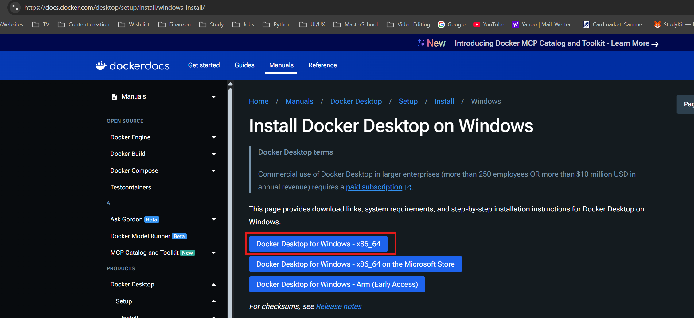

Dadurch wird eine EXE-Datei heruntergeladen. Unter `System requirements` steht noch das bestimmte Anforderungen erfüllt werden müssen:

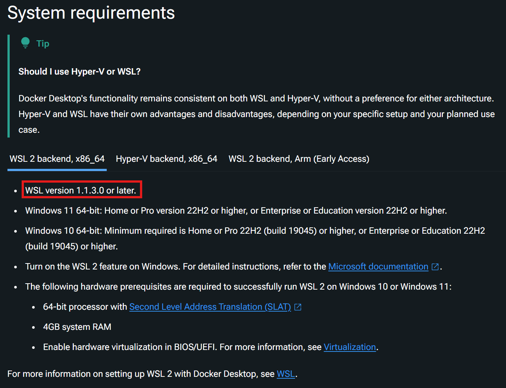

Dabei wird der sogenannte `WSL2` benötigt. Es ist eine Technologie von Microsoft, die es erlaubt, Linux direkt unter Windows auszuführen – und zwar nicht als Emulation, sondern als echter Linux-Kernel, der in einer leichtgewichtigen virtuellen Maschine läuft. Docker verwendet Linux-Container-Technologie, die auf dem Linux-Kernel basiert (z. B. Namespaces, cgroups). Da Windows keinen Linux-Kernel hat, braucht man eine Art „Unterbau“, um diese Container korrekt laufen zu lassen.
<br>
<br>

Um herauszufinden ob `WSL2` auf dem PC vorhanden ist, öffnet man CMD. Anschließend gibt man `WSL` ein, falls eine so ähnliche Ausgabe erzeugt wird, ist `WSL` vorhanden:

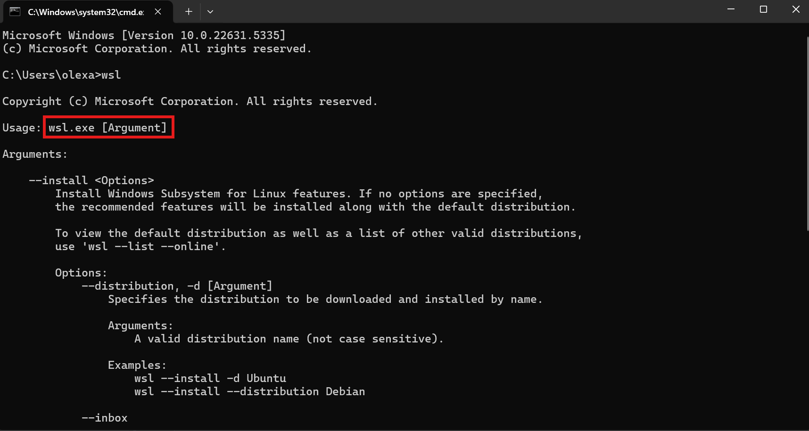

Falls jedoch `WSL` nicht vorhanden ist, kann man mit `wsl --install` die Installation durchführen.
<br>
<br>
Achtet darauf dass auch eine bestimmte Windows Version erforderlich ist:

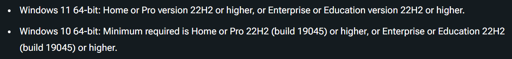

Die genau Windows-Version, welche unterstützt wird, findet man auf der Installationsseite. In CMD kann man mit `winver` herausfinden, welche Windows-Version auf dem Computer installiert ist:

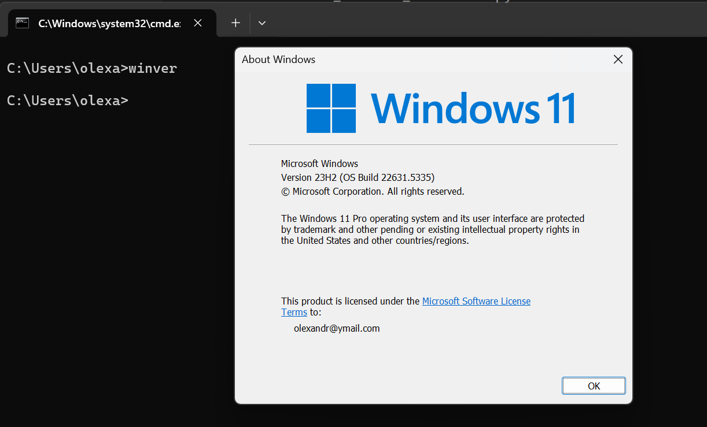

Nun muss man das `WSL2` feature einschalten. Dazu suche ich unter Start nach `Turn Windows features on or off` und klicke drauf. Es erscheint folgendes Fenster:

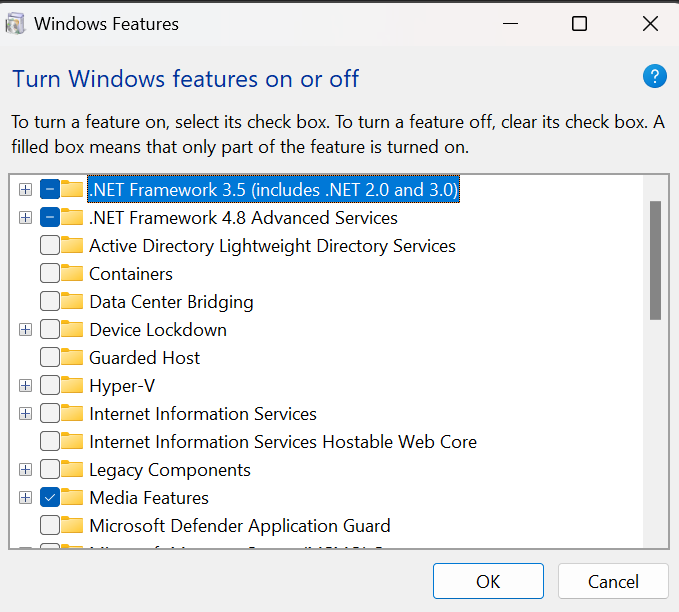

Innerhalb der Liste suchen wir nach `Windows Subsystem for Linux` und durch einen Klick in die Checkbox wird dieses feature eingeschaltet. Anschließend bestätigt man mit `OK`:

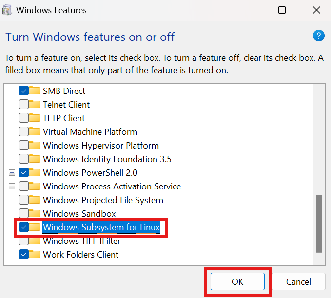

Anschließend erscheint folgendes Fenster, wobei wir auf `Don't restart` klicken, da wir später einen Neustart durchführen:

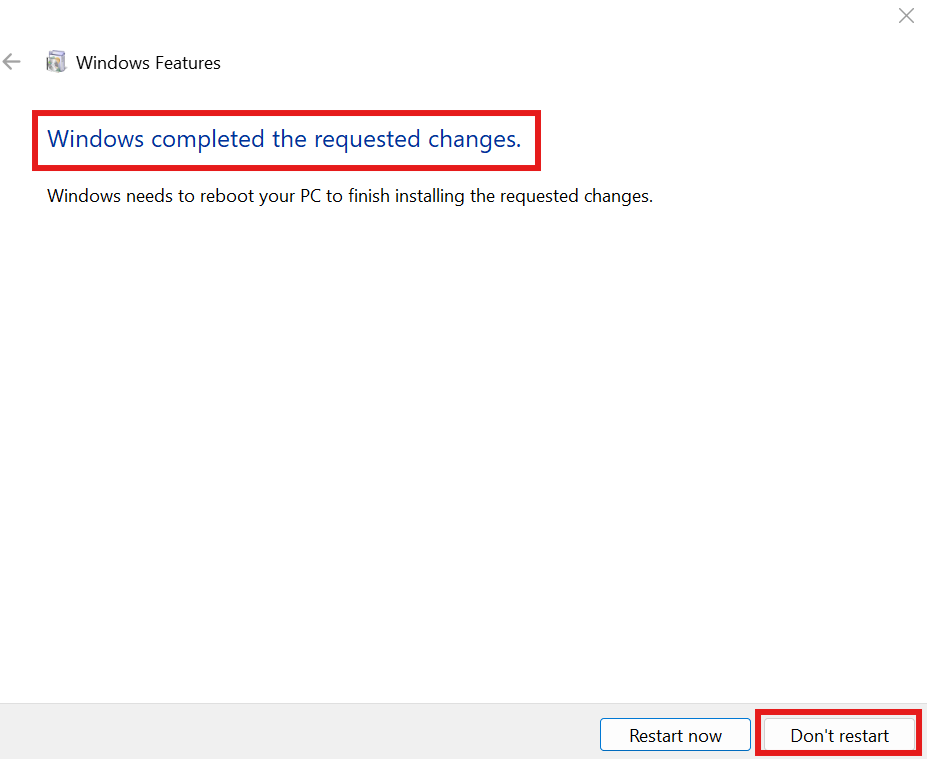

Als nächstes müssen wir prüfen ob die Virtualisierung unter Windows eingeschaltet ist. Dazu klicken wir `CRTL + SHIFT + ESCAPE`, wodurch sich der Task Manager öffnet. Unter `Performance` kann man sehen ob die Virtualisierung eingeschaltet ist:

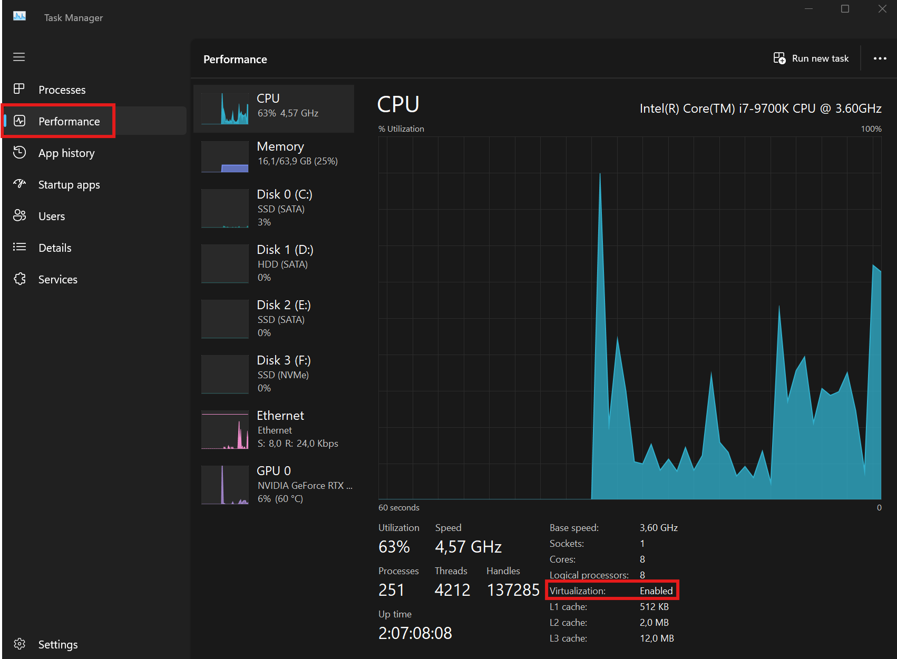

Nun ist es an der Zeit die EXE-Datei, welche wir am Anfang heruntergeladen hatten, auszuführen:

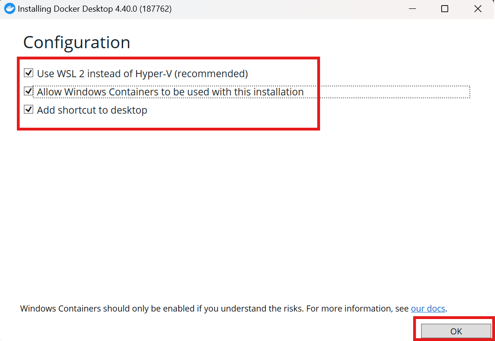

Anschließend drücken wir auf `OK` und die Installation startet:

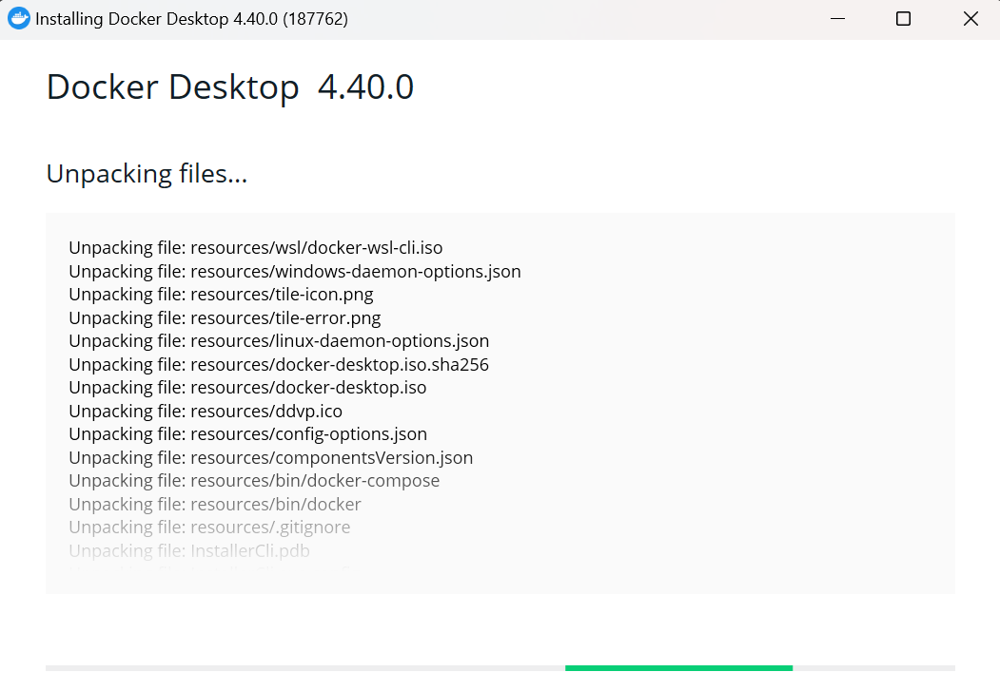

Wenn die Installation erfolgreich war, sollte so ein Fenster zu sehen sein:

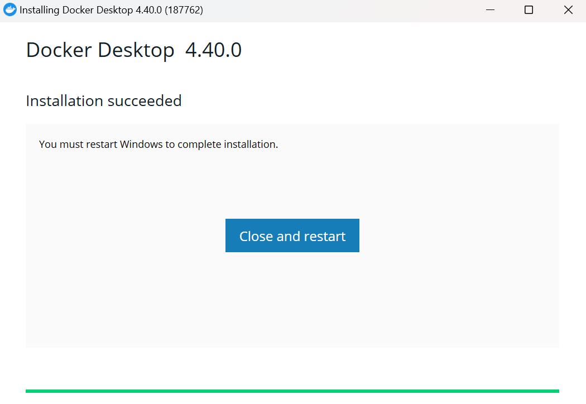

Nun ist es an der Zeit dem Computer neu zu starten. Dann sollte so ein Fenster erscheinen:

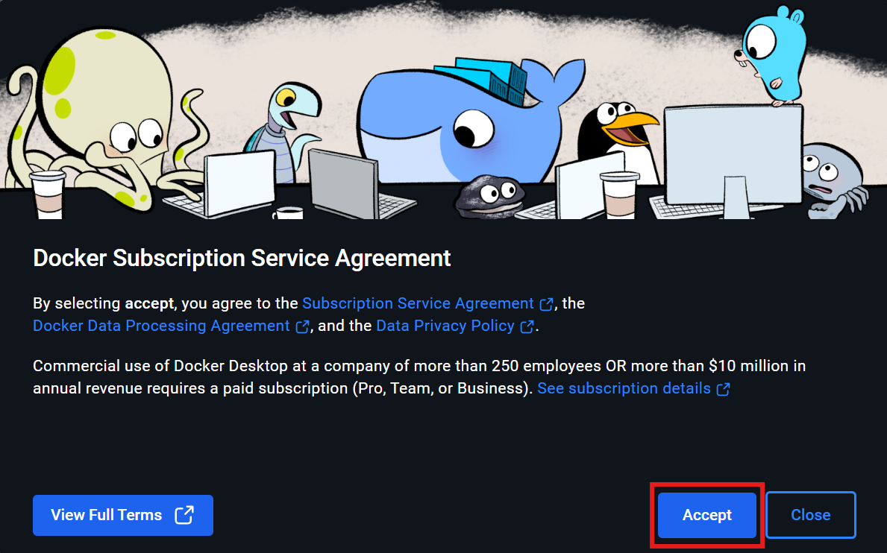

Wir verwenden die empfohlenen Einstellungen:

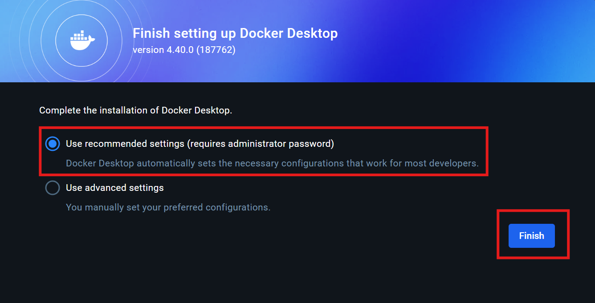

Alle anderen Fragen die nun kommen kann man überspringen oder einfach ausfüllen:

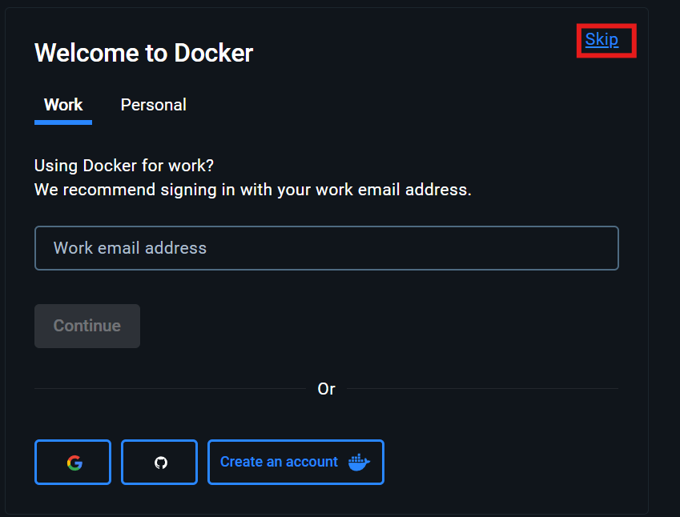

So sieht am Ende das finale Fenster aus:

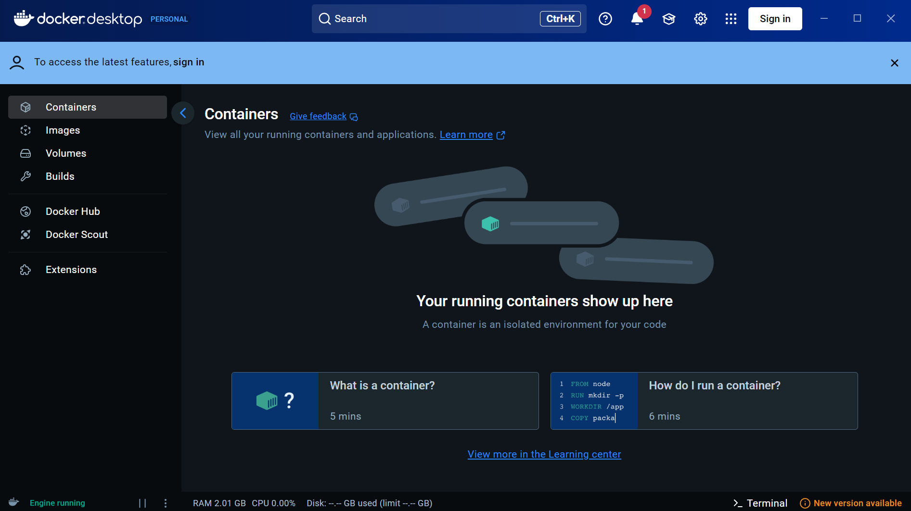

Docker Desktop bietet eine benutzerfreundliche Möglichkeit, mit Containern zu arbeiten, ohne zwingend über die Kommandozeile arbeiten zu müssen. Insbesondere für Entwickler, die in einer lokalen Umgebung mit Containern experimentieren, testen oder entwickeln möchten, ist Docker Desktop ein nützliches Werkzeug.
<br>
<br>

Docker Desktop enthält unter anderem:

- **Docker Engine:**<br>
  Das ist die Laufzeitumgebung für die Container bzw. der zentrale Diennst, der Container baut, startet und verwaltet. Es ist also das technische Rückgrat von allem, was Docker ermöglicht.

- **Docker CLI:**<br>
  CLI steht für Command Line Interface, also Kommandozeilen-Schnittstelle. Die Docker CLI ist das Werkzeug, mit dem man Docker über die Eingabe von Textbefehlen steuern kann – ganz ohne grafische Oberfläche. Ein CLI-Programm wird im Terminal (z.B. PowerShell, CMD, bash...) verwendet. Es basiert auf Textbefehlen, die vom Benutzer eingegeben werden, und gibt ebenfalls Text als Antwort zurück.

- **Docker Compose:**<br>
  Docker Compose ist ein Werkzeug, mit dem man mehrere Container gleichzeitig starten und verwalten kann. Man beschreibt die gesamte Anwendung in einer YAML-Datei – das ist eine einfache Textdatei mit einer bestimmten Struktur.

- **GUI (Dashboard):**<br>
   Eine grafische Oberfläche zur Verwaltung von Containern, Images, Volumes und Netzwerken.

- **Kubernetes:**<br>
  Ein Werkzeug zur Verwaltung vieler Container auf einmal – sozusagen ein "Container-Orchester".
  Während Docker dafür da ist, einen Container oder ein paar Container zu starten, übernimmt Kubernetes die Steuerung von vielen Containern auf vielen Rechnern. In Docker Desktop ist Kubernetes optional enthalten.

Seit 2021 ist Docker Desktop für kommerzielle Nutzung kostenpflichtig, wenn das Unternehmen mehr als eine bestimmte Anzahl von Mitarbeitern bzw. Umsatz hat. Für Einzelpersonen, Bildungseinrichtungen (z.B. Hochschulen) und kleinere Unternehmen bleibt die Nutzung jedoch kostenfrei. Dennoch ist eine Anmeldung mit einem Docker Hub Account erforderlich.
<br>
<br>
Viele Dinge in Docker Desktop funktionieren auch ohne Account, vor allem für den lokalen Gebrauch. Aber es gibt wichtige Vorteile, wenn man sich einen kostenlosen Docker-Account erstellt. Ein Docker-Account (kostenlos) ermöglicht Zugriff auf zusätzliche Online-Funktionen und Cloud-Dienste von Docker, die besonders bei der Zusammenarbeit und bei komplexeren Projekten nützlich sind.

**Testen der Installation:**

Bevor man mit komplexen Anwendungen in Docker arbeitet, ist es sinnvoll, mit einem einfachen Beispiel zu starten – der sogenannten "Hello World"-Anwendung. Diese Anwendung ist ein Mini-Container, der nur dazu dient, zu prüfen, ob Docker korrekt installiert ist und Container funktionieren. Sie ist wie ein "Testlauf", bei dem Docker einmal alles durchspielt:

- ein Container wird gestartet,

- eine einfache Aufgabe wird ausgeführt,

- Docker gibt eine Rückmeldung.

Sobald Docker installiert ist, gibt man im Terminal (z.B. CMD, Terminal oder PowerShell) folgenden Befehl ein:

```
docker run hello-world
```

Was passiert nun dabei?
1. Der Befehl wird über CLI an Docker Engine geschickt:

   - `docker run` bedeutet: "Starte einen Container aus einem Image."

   - Ein Image ist wie ein Bauplan, der alles enthält, was eine Anwendung zum Laufen braucht – z.B. Programmcode, Bibliotheken und Einstellungen.

   - `hello-world` ist der Name des Images.
2. Docker sucht lokal nach dem Image:

   - Wenn das Image noch nicht vorhanden ist, wird es automatisch von Docker Hub heruntergeladen.

   - Docker Hub ist wie ein App-Store für Container. Dort findet man fertige Images und kann auch eigene Images hochladen.
3. Docker startet einen Container aus dem Image:

   - Der Container führt ein kleines Programm aus, das eine Nachricht auf die Konsole schreibt.
  1. Der Container beendet sich sofort danach, da er seine Aufgabe erfüllt hat.

Wenn alles erfolgreich installiert wurde, sollte die Ausgabe in etwa so aussehen:

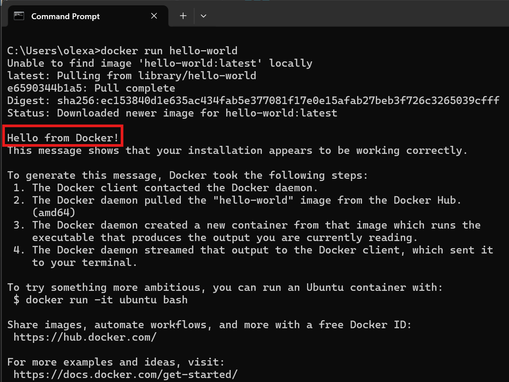

Wenn man nun im Docker Desktop nachschaut, dann sieht man unter "Images" plötzlich einen neuen Eintrag. Der Eintrag `hello-world` erscheint als heruntergeladenes Image in der Liste. Dieses Image wurde automatisch aus Docker Hub geladen, als der Befehl `docker run hello-world` ausgeführt wurde.

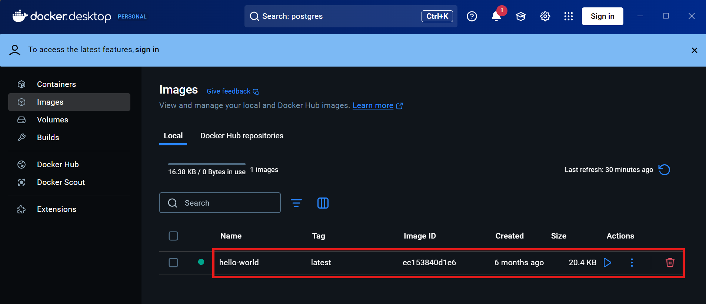

Das bedeutet: Docker speichert dieses Image lokal, damit man es erneut verwenden kann – ohne es nochmal herunterzuladen. Man kann dieses Image auch manuell löschen, wenn es nicht mehr benötigt wird, z.B. über das Papierkorb-Symbol in Docker Desktop oder über das Terminal mit:

```
docker rmi hello-world
```

Es kann sein das folgender Fehler erscheint:

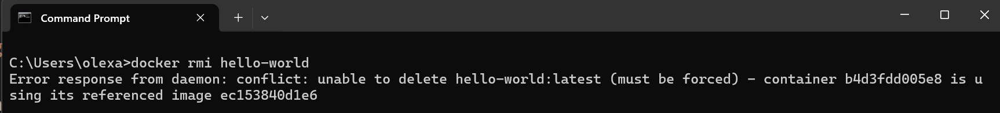

Dann blockiert Docker das Löschen, weil es noch einen Container gibt, der mit diesem Image erstellt wurde – selbst wenn der Container gestoppt ist. Ein Docker Container wird immer aus einem Image erstellt. Man kann sich das so vorstellen:

- Das Image ist der Bauplan oder die Vorlage.

- Der Container ist das laufende oder gespeicherte Exemplar, das daraus gebaut wurde.

Solange mindestens ein Container existiert, der auf dieses Image verweist, erlaubt Docker aus Sicherheitsgründen kein Löschen des Images.
<br>
<br>
In Docker Desktop gibt es links ein Menü. Dort findet man unter "Containers" eine Liste aller Container:

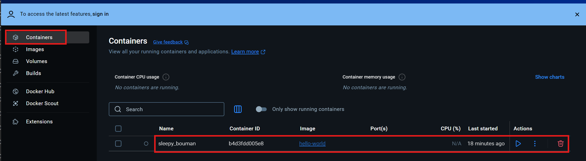

Hier sieht man einen Eintrag mit dem Namen `hello-world` und genau diesen Container möchten wir entfernen, um das `hello-world` Image zu löschen. Wir tun dies über das Terminal mit den folgenden Befehl:

```
docker container rm [CONTAINER-ID]
```

Achtet darauf dass ihr die `[CONTAINER-ID]` durch eine Zahl ersetzt. Anschließend sollte dieser Container aus der Luste unter "Containers" verschwinden. Nun können wir das `hello-world` Image entfernen:

```
docker rmi hello-world
```

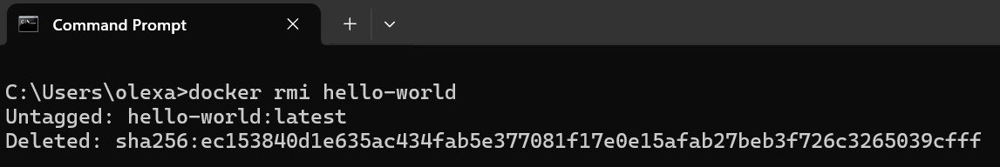

Unter Images dürfe nun kein Image mit dem Namen `hello-world` vorhanden sein. Damit bleibt die lokale Umgebung sauber und übersichtlich.


## Übungsaufgabe: Wiederholung Windows-Installation und Hello World

Bearbeite die folgenden Schritte und beantworte die Fragen. Führe die Befehle in CMD oder PowerShell aus.

{{ task(file="tasks/02_00_01.yaml") }}


{{ task(file="tasks/02_00_02.yaml") }}


{{ task(file="tasks/02_00_03.yaml") }}


