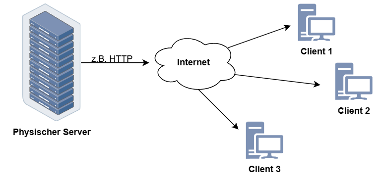
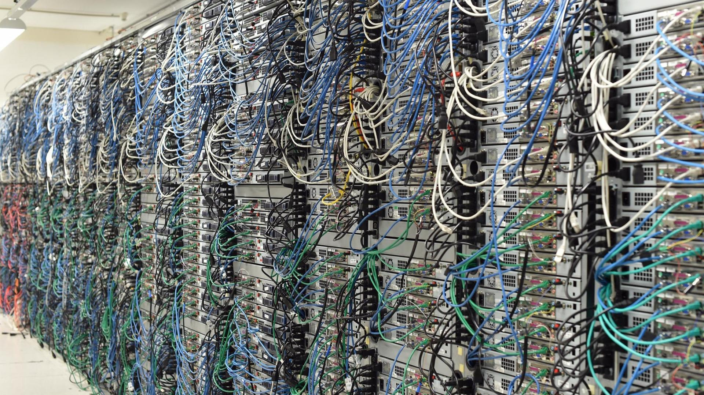
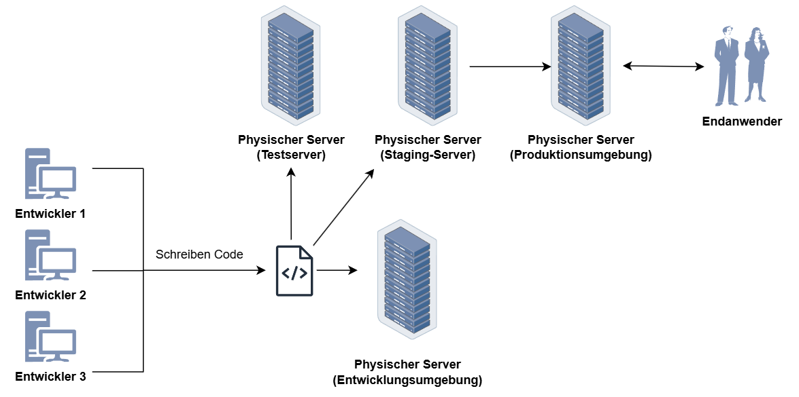
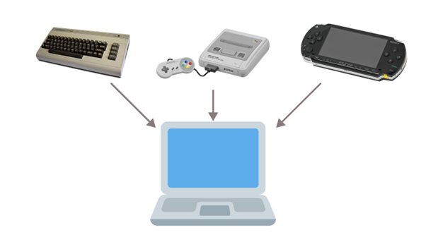
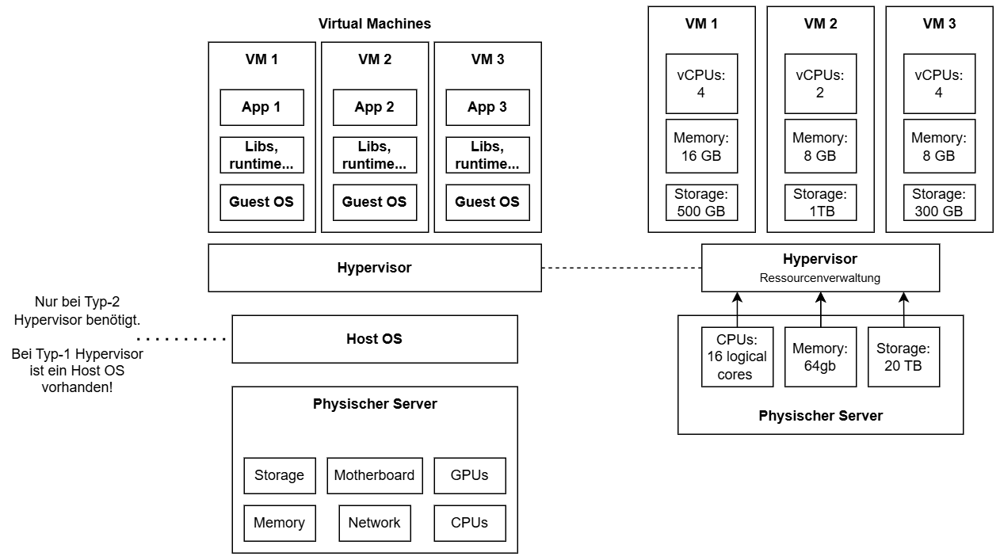
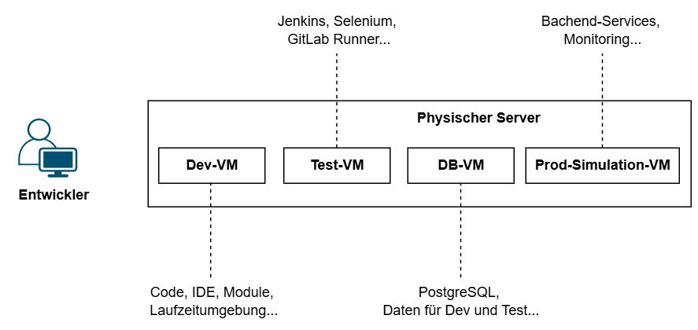
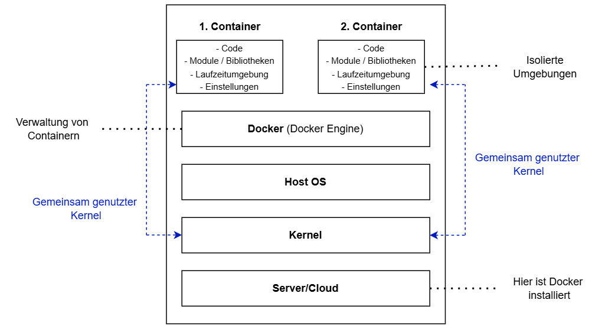
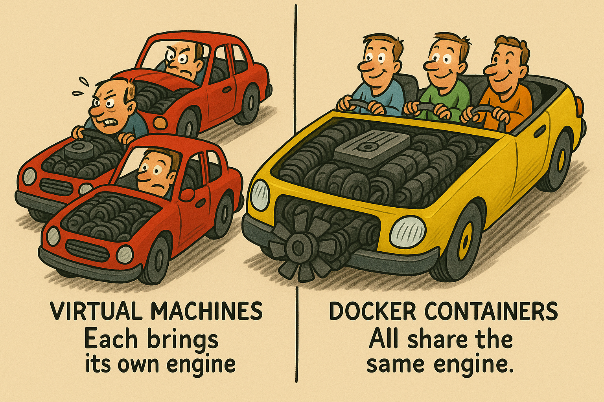

# Einführung in Docker

Um besser zu verstehen, was genau Docker ist, sollte man sich vorher mit physischen Servern und virtuellen Maschinen auseinandersetzen.

## Physischer Server

Ein physikalischer Server ist im Grunde genommen ein großer, leistungsstarker Computer. Dieser computer hat eine eigene Hardware, die aus Komponenten wie Haupt-Prozessor (CPU), Arbeitsspeicher (RAM), Festplatten und Netzwerkschnittstellen besteht. Außerdem ist in fast allen Fällen ein Betriebssystem vorhanden, um das Zusammenspiel der Hardwarekomponenten mit der Software, durch eine "schöne" Oberfläche zu ermöglichen.

Physikalische Server befinden sich oft in Rechenzentren, wo sie spezielle Aufgaben erfüllen, wie z.B. das Hosten von Websites, das Speichern von Datenbanken oder das Ausführen von Anwendungen. Dies ist der traditionelle Weg, wie Softwareingenieure die programmierten Anwendungen ausführten bzw. entwickelt hatten.

So könnte ein Rechenzentrum mit Servern aussehen:

{ width="70%" }

Man kann die physischen Server auch in verschiedene Kategorien unterteilen wie z.B.:

- Web-Server

- Proxy-Server

- FTP-Server

- Datenbank-Server

- Druckserver

Traditionell wird diese Software auf physischen Servern entwickelt bzw. auch bereitgestellt. Der Ablauf könnte folgendermaßen aussehen:

1. Entwickler arbeiten zunächst auf ihren lokalen Maschinen, um den Code zu schreiben und grundlegende Tests durchzuführen. Für komplexere Tests richteten sie Entwicklungsumgebungen auf physischen Servern ein, welche die Produktionsumgebung nachahmten.
2. Nach der Entwicklung wurde die Software auf Testservern bereitgestellt, die ebenfalls physische Server waren. Hier wurden verschiedene Tests durchgeführt, wie z.B. Integrationstests und Systemtests, um sicherzustellen, dass sie Software korrekt funktionierte.
3. Vor dem endgültigen Rollout (ausliefern der Software) wurde die Software auf Staging-Servern installiert. Diese physischen Server bildeten die Produktionsumgebung so genau wie möglich nach, um letzte Überprüfungen und Tests unter realistischen Bedingungen durchzuführen.
4. Sobald die Software alle Tests bestanden hatte, wurde sie auf den Produktionsservern bereitgestellt. Diese physischen Server waren dafür verantwortlich, die Software für die Endbenutzer bereitzustellen und zu betreiben.
5. Nach der Bereitstellung überwachten Entwickler und IT-Teams die Serverleistung, führten regelmäßige Wartungsarbeiten durch und rollten bei Bedarf Updates und Patches aus, um die Software aktuell und sicher zu halten.

Diese Prozesse sind jedoch sehr zeitaufwändig und erfordern eine sorgfältige Planung und Verwaltung der physischen Serverressourcen.

## Virtuelle Maschinen (VMs)

Nach dem die Grundlagen physischer Server und ihre Rolle in der traditionellen Softwareentwicklung verstanden wurde, werden wir uns einem moderneren Konzept wenden: Den virtuellen Maschinen.
 
 
Virtuelle Maschinen haben die Art und Weise, wie wir Serverressourcen nutzen, revolutioniert und bieten viele Vorteile gegenüber physischen Servern. Eine virtuelle Maschine (VM) ist im Wesentlichen ein Software-Emulator, der wie ein eigenständiger Computer funktioniert. Ein Software-Emulator ist ein Programm, dass die Hardware eines Computers nachahmt und es ermöglicht, Software so auszuführen, als würde sie auf der tatsächlichen Hardware laufen.
 
 

**Zur Vorstellung eines Software-Emulators ein Beispiel:**

Stellt euch vor, ihr habt ein altes Nintendo-Spiel, das ihr früher auf einer Nintendo-Konsole gespielt habt. Jetzt habt ihr keine Konsole mehr, sondern nur noch den Computer. Ihr möchtet das alte Spiel trotzdem spielen. Hier kommt der Emulator zum Einsatz. Ihr ladet euch ein Emulator-Programm auf den Computerherunter, das die Nintendo-Konsole nachahmt. Ihr ladet auch das Nintendo-Spiel auf den Computer. Anschließend startet ihr den Emulator und öffnet das Spiel darin. Der Emulator verhält sich wie eine Nintendo-Konsole. Euer Computer denkt, er wäre die Konsole, und das Spiel denkt, es würde auf der echten Nintendo-Konsole laufen. So könnt ihr das Nintendo-Spiel auf euerem Computer spielen, obwohl es eigentlich für die Konsole gedacht ist.

**Zurück zu dem VMs:**

Eine VM (sowas wie ein Software-Emulator) läuft auf einem physischen Server, nutzt dessen Ressourcen, wird aber durch eine Software namens Hypervisor verwaltet. Der Hypervisor ermöglicht es, mehrere VMs auf einem einzigen physischen Server zu betreiben, wobei jede VM ein eigenes Betriebssystem und eigene Anwendungen haben kann, unabhängig von den anderen VMs auf demselben Server.
 
 
Man kann sich der Hypervisor wie einen Verwalter vorstellen, der die Ressourcen eines Computers so aufteilt, dass mehrere unabhängige VMs gleichzeitig laufen können.

**Hypervisor:** Teilt Ressourcen des Host-Servers auf mehrere isolierte VMs auf.

{ width="70%" }

Die moderne Softwareentwicklung auf VMs, hat sich stark von der traditionellen Entwicklung auf physischen Servern weiterentwickelt. Angenommen, ein Softwareunternehmen entwickelt eine Webanwendung:

1. Die Entwickler verwenden jeweils eine eigene VM, um verschiedene Komponenten der Anwendung zu entwickeln und zu testen. Jede VM ist mit den erforderlichen Entwicklungswerkzeugen und Bibliotheken ausgestattet.
2. QA-Teams führen Tests auf speziell eingerichteten VMs durch, um die Funktionalität, Sicherheit und Leistung der Anwendung zu überprüfen. Sie können verschiedene Szenarien simulieren und sicherstellen, dass die Anwendung unter verschiedenen Bedingungen einwandfrei funktioniert.
3. Vor der endgültigen Bereitstellung wird die Anwendung auf einer Staging-VM getestet, die der Produktivumgebung ähnelt. Nach erfolgreichen Tests wird die Anwendung auf die Produktions-VMs bereitgestellt, welche die eigentliche Anwendung für Endbenutzer hosten.

Durch die VMs hat man bei der Softwareentwicklung eine Menge von Vorteilen:

1. **Flexibilität:** VMs ermöglichen es Entwicklern, schnell und einfach verschiedene Entwicklungsumgebungen einzurichten und zu nutzen. Jede VM kann ein eigenes Betriebssystem und eine eigene Konfiguration haben, was es einfach macht, verschiedene Softwareversionen und -stacks zu testen-
2. **Isolation:** Jede VM ist isoliert von anderen VMs und der zugrundeliegenden Hardware. Das bedeutet, dass Änderungen oder Probleme in einer VM die anderen nicht beeinträchtigen. Dies erleichtert das Testen und die Entwicklung von Software in einer kontrollierten Umgebung.
3. **Skalierbarkeit:** Unternehmen können ihre Serverressourcen effizienter nutzen, indem sie mehrere VMs auf weniger physischen Servern betreiben. Dies emöglicht es, schnell neue VM-Instanzen zu erstellen oder bestehende zu entfernen, je nach Bedarf.
4. **Schnelle Bereitstellung:** VMs können schnell bereitgestellt werden, was den Entwicklungszyklus beschleunigt. Neue VMs können in wenigen Minuten einsatzbeareit sein, im Gegensatz zu physischen Servern, die möglicherweise Tage oder Wochen zur Bereitstellung benötigen.
5. **Reproduzierbarkeit:** Da VMs als Images (Momentaufnahme eines kompleten Software-Systems) gespeichert werden können, ist es einfach, eine bestimmte Entwicklungsumgebung zu sichern, zu klonen oder wiederherzustellen. Dies erleichtert die Reproduktion von Fehlern und die Überprüfung von Software in verschiedenen Umgebungen.
6. **Kosteneffizienz:** Durch die Konsolidierung (Zusammenführen) mehrerer VMs auf weniger Hardware können Unternehmen Kosten sparen, da weniger physische Server benötigt werden. Auch die Wartung und Verwaltung der Infrastruktur wird vereinfacht.

Um die Vorteile von Docker zu verstehen, setzen wir unsere Reise von physischen Servern und virtuellen Maschinen fort. Virtuelle Maschinen haben die Flexibilität und Effizient in der Softwareentwicklung erhöht, aber Docker geht noch einen Schritt weiter.

## Was ist Docker

Docker ist eine Plattform, die es ermöglicht, Anwendungen und deren Abhängigkeiten (z.B. Bibliotheken, Datenbanken oder Laufzeitumgebungen...) in sogenannten Containern zu verpacken. Ein Docker-Container ist eine Art isolierte Umgebung, die alle notwendigen Bibliotheken und Konfigurationen enthält, um eine Anwendung auszuführen.
 
 
Anders als bei virtuellen Maschinen nutzen Docker-Container den gleichen Kernel (das Herzstück) des Betriebssystems, auf dem sie laufen. Das bedeutet, dass Docker-Container nicht wie virtuelle Maschinen ihr eigenes komplettes Betriebssystem haben. Stattdessen teilen sie sich den zentralen Teil des Betriebssystems, der direkt mit der Hardware des Computers kommuniziert.
 
 
Diese gemeinsame Nutzung macht Docker-Container effizienter, da sie weniger Ressourcen benötigen und schneller starten können im Vergleich zu virtuellen Maschinen, die jedes Mal eine komplette Kopie des Betriebssystems mitbringen müssen.

**Bildhafte Vorstellung:**

Falls man bei der Vorstellung bezüglich der "Teilung des gleichen Kernels" Schwierigkeiten hat, könnte folgende bildhafte Vorstellung behilflich sein:

- Stellt euch vor, der Kernel des Betriebssystems ist wie ein Motor in einem Auto. Dieser Motor (Kernel) ist entscheidend, um das Auto (Computer) zum Laufen zu bringen. Bei virtuellen Maschinen ist es so, als ob jedes Auto sein eigenes Motorenset hat, komplett mit allen Teilen, die es zum Fahren benötigt.

- Bei Docker-Containern ist es anders. Alle Container teilen sich denselben Motor (Kernel) des Autos (Betriebssystems). Jeder Container hat sein eigenes Cockpit und seine eigenen Steuerungen, aber sie alle nutzen denselben Motor, um sich fortzubewegen.

## Die Docker Container

Container basieren also auf der Idee der Virtualisierung, allerdings auf einer leichteren und effizienteren Ebene als traditionelle virtuelle Maschinen. Bei VMs wird ein komplettes Betriebssystem auf einem sogenannten Hypervisor nachgebildet. Container hingegen nutzen den gleichen Betriebssystem-Kernel, teilen sich also das Grundsystem und laufen trotzdem getrennt voneinander auf dem gleichen Computer.
 
 
Man kann sich Container wie kleine, abgeschlossene Pakete vorstellen. In einem Paket ist eine Anwendung und alles, was sie benötigt, enthalten. So ein Paket enthält zum Beispiel:

- Den Programmcode

- Alle notwendigen Programme und Bibliotheke, die das Programm benötigt

- Einstellungen und Konfigurationen

## Warum Container?

Ihr möchtet ein Programm auf einem anderen Computer ausführen, aber dort fehlen einige notwendige Programme oder die Einstellungen sind anders, Das führt oft zu Problemen und Fehlern.
 
 
Mit Docker packt ihr das Programm und alles, was es braucht, in ein Container. Dieser Container läuft überall gleich, egal auf welchem Computer oder Betriebssystem, solange Docker oder eine ähnliche Container-Technologie installiert ist.

**Beispiel:**

Stellt euch vor, drei Entwickler arbeiten an einer Webanwendung. Jeder von ihnen benutzt ein anderes Betriebssystem:

1. Anna arbeitet auf einem Max.
2. Ben nutzt Windows
3. Calra verwendet Linux

Die Entwickler müssen sicherstellen, dass die Webanwendung auf allen Betriebssystemen einwandfrei funktioniert, was oft zu Problemen führt, weil jede Plattform unterschiedliche Abhängigkeiten und Konfigurationen benötigt. Ohne Docker müsste jeder entwickler sicherstellen, dass alle notwendigen Programme und Bibliotheken auf seinem Betriebssystem korrekt installiert sind. Das kann zu Kompatibilitätsproblemen führen und viel Zeit kosten.
 
 

Jetzt kommt Docker ins Spiel. Statt sich um die Installation und Konfiguration der Abhängigkeiten auf jedem Betriebssystem zu kümmern, packen die Entwickler die Webanwendung in einem Docker-Container. Dieser Container enthält alles, was die Anwendung zum Laufen benötigt:

- Den Webserver

- Die Laufzeitumgebung

- Bibliotheken

- Einstellungen

Egal ob Anna, Ben oder Clara, alle müssen nur Docker auf ihrem System installieren. Dann können sie den Container ausführen und die Anwendung läuft überall gleich, unabhängig davon, welches Betriebssystem sie benutzen. Der Container sorgt dafür, dass die Anwnedung in einer identischen Umgebung läuft, unabhängig davon, ob es ein Mac, Windows oder Linux ist.
 
 
Zusammengefasst: Mit Docker spielt es keine Rolle, welches Betriebssystem die Entwickler benutzen, weil der Container die gesamte notwendige Umgebung für die Anwendung mitbringt und überall gleich funktionieren. Daraus ergeben sich folgende Unterschiede für physische Server, VMs und Container:

| Aspekt                      | Physischer Server                                | VM                                                      | Container                                                    |
| --------------------------- | ------------------------------------------------ | ------------------------------------------------------- | ------------------------------------------------------------ |
| Isolation                   | Jeder Server ist vollständig isoliert            | Jede VM ist isoliert, teilt jedoch denselben Hypervisor | Jeder Container ist isoliert, teilt aber den Kernel           |
| Ressourcen                  | Hat exklusive Hardware-Ressourcen                | Zwischen VMs aufgeteilt                                 | Effizientere Nutzung durch Kernel-Teilung                     |
| Performance                 | Hohe Leistung, direkter Zugriff auf Hardware     | Geringfügige Leistungseinbußen durch Hypervisor         | Sehr geringe Leistungseinbußen da (kein Betriebssystem)      |
| Skalierbarkeit              | Erfordert physische Hardwareänderungen           | Flexibel durch Hinzufügen/Entfernen von VMs             | Sehr schnelle Skalierung durch Starten/Stoppen von Containern |
| Portabilität                | Nicht möglich wegen physischer Hardware          | Zwischen unterschiedlichen Hypervisoren                 | Sehr portabel auf verschiedenen Umgebungen                   |
| Startzeit                   | Sehr Langsam (kann Minuten dauern)               | Schneller als physische Server                          | Sekundenschnell (am schnellsten)                             |
| Isolationsstufe             | Hohe Isolation                                  | Mittlere Isolation zwischen VMs                         | Isoliert, bis auf Kernel                                     |
| Komplexität                 | Je nach Anwendung (oft schwierig wegen Hardware) | Komplexe Verwaltung von mehreren VMs und Hypervisoren   | Sehr einfache Verwaltung von Containern                      |
| Entwicklungsgeschwindigkeit | Langsame Bereitstellung und Entwicklung          | Schneller als bei physischen Servern                    | Am schnellsten                                               |
| Anwendungsbereiche          | Spezialisierte dauerhafte Workloads              | Vielseitig für z.B. Testumgebung                        | Ideal für Cloud, Microservices, DevOps...                    |

In der Praxis arbeiten Data Engineers mit vielen verschiedenen Tools, Programmiersprachen, Frameworks und Datenquellen – etwa Python, Spark, Kafka, Airflow, Datenbanken wie PostgreSQL oder MongoDB sowie Cloud-Speicherdiensten. Jedes dieser Systeme hat eigene Abhängigkeiten, Versionen und Konfigurationen. Hier kommt Docker ins Spiel.
 
 
Docker ermöglicht es, Container zu erstellen – also abgeschlossene, isolierte Software-Umgebungen, in denen eine bestimmte Anwendung samt aller nötigen Komponenten (Code, Bibliotheken, Laufzeitumgebung, Einstellungen) enthalten ist. So kann ein Data Engineer beispielsweise einen Container bauen, der einen bestimmten ETL-Prozess (Extract, Transform, Load) ausführt – unabhängig vom Betriebssystem oder den installierten Tools auf dem Server oder Entwicklerrechner. Das macht die Umgebung reproduzierbar und plattformunabhängig.
 
 
Jeder Schritt im Datenverarbeitungsprozess kann in einem eigenen Container ablaufen – zum Beispiel die Datenextraktion aus einer API, die Bereinigung mit Python oder Spark, und schließlich das Laden in eine Datenbank oder ein Data Warehouse. Diese Container können unabhängig voneinander entwickelt, getestet und ausgetauscht werden. Das erhöht die Flexibilität und Wartbarkeit der gesamten Pipeline.
 
 
Zusammengefasst ist Docker ein unverzichtbares Werkzeug im modernen Data Engineering, weil es hilft, Prozesse zu vereinfachen, zu standardisieren und über Systemgrenzen hinweg reproduzierbar zu machen

