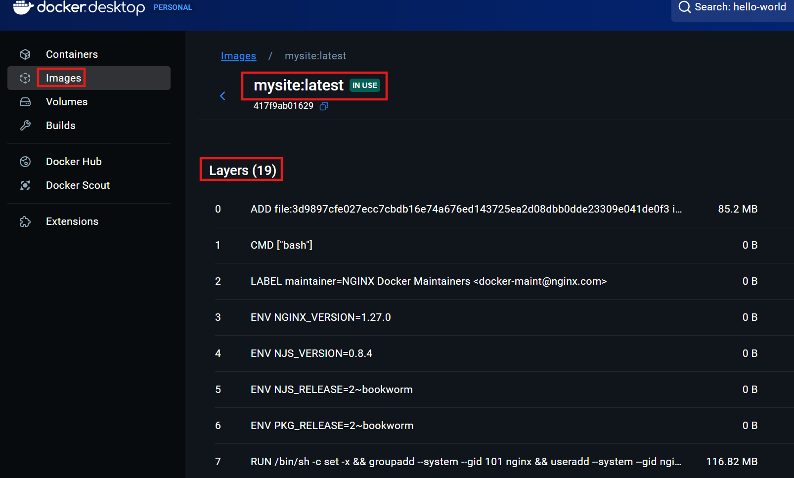

# Docker Layers – Wie Docker Images wirklich aufgebaut sind

Beim Erstellen eigener Docker-Images mit einem Dockerfile haben wir gesehen, dass ein Image aus mehreren Befehlen entsteht – zum Beispiel FROM, COPY, RUN oder CMD. Was viele nicht wissen: Jeder dieser Befehle erzeugt eine sogenannte Layer (Schicht) im Image.
<br>
<br>
Dieses Layer-Konzept ist ein zentraler Bestandteil von Docker. Es hilft dabei:

- Images effizient zu speichern,

- wiederverwendbare Teile zwischen Builds zu cachen,

- und kleinere Änderungen blitzschnell zu übernehmen.

## Was sind Layers

Ein Layer (auf Deutsch: Schicht) ist ein Baustein, aus dem ein Docker-Image zusammengesetzt ist.

Man kann sich das vorstellen wie bei einer Lasagne:

- Jede einzelne Zutat wird Schicht für Schicht aufgetragen – am Ende ergibt alles zusammen das vollständige Gericht.

- Genauso entsteht auch ein Docker-Image Schritt für Schritt – jede Zeile im Dockerfile ist eine neue Schicht, also ein Layer.

Ein Layer ist eine Momentaufnahme einer Änderung im Dateisystem.
Das bedeutet: Immer wenn im Dockerfile eine neue Anweisung steht, merkt sich Docker nur das, was sich verändert hat. Die vorherigen Schichten bleiben unverändert bestehen.
<br>
<br>
Schauen wir uns ein konkretes Beispiel an:

```dockerfile
FROM python:3.12-slim                # Layer 1: Basis-Image mit Python
WORKDIR /app                         # Layer 2: Wechselt ins Arbeitsverzeichnis /app
COPY requirements.txt .              # Layer 3: requirements.txt wird ins Image kopiert
RUN pip install -r requirements.txt  # Layer 4: Python-Pakete werden installiert
COPY . .                             # Layer 5: Quellcode wird ins Image kopiert
CMD ["python", "main.py"]            # Layer 6: Startbefehl für den Container
```

- **Layer 1:**<br>
  Docker lädt ein fertiges Python-Image aus dem Docker Hub, das ist die Grundlage.

- **Layer 2:**<br>
  Es wird ein Ordner namens /app als Arbeitsverzeichnis gesetzt. Ab jetzt spielen sich alle weiteren Schritte dort ab.

- **Layer 3:**<br>
  Eine Datei `requirements.txt` wird vom eigenen Rechner ins Image kopiert.

- **Layer 4:**<br>
  Alle dort aufgelisteten Pakete werden installiert. Das kann z. B. flask, numpy, requests usw. sein.

- **Layer 5:**<br>
  Der restliche Quellcode wird ebenfalls ins Image übernommen.

- **Layer 6:**<br>
  Es wird festgelegt, was passiert, wenn man den Container startet (hier: Python-Programm ausführen).

Jeder dieser Schritte wird einzeln gespeichert – als eine eigene Schicht. Wenn man später etwas am Dockerfile ändert, muss nicht alles neu gebaut werden – nur die betroffenen Layers.
<br>
<br>
Betrachten wir die Layers von unserem selbst erstellten `mysite`-Image. Dazu klicken wir im Docker Desktop auf den `mysite`-Image und sehen direkt die Layers:



Docker merkt sich beim Bauen, welche Layers bereits existieren. Wenn man das Dockerfile ein zweites Mal baut, muss Docker nicht alles neu berechnen, sondern kann bestehende Schichten aus dem Cache übernehmen. Wenn man am z.B. Quellcode Layer 5 etwas ändert, bleibt Layer 3 und 4 unverändert und können aus dem Cache übernommen werden. Das spart enorm viel Zeit. Als Faustregel kann man sich merken:

- Je früher eine Änderung im Dockerfile, desto mehr Layers müssen neu gebaut werden. Deshalb sollte man möglichst unveränderliche Befehle zuerst schreiben.

## Sicherheitsaspekt von Layers

Beim Umgang mit Docker ist es besonders wichtig, die Sicherheit der erstellten Images zu berücksichtigen. Ein zentrales Konzept in diesem Zusammenhang ist die Unveränderlichkeit von Layers – und welche Folgen das für sensible Daten wie Passwörter, Zugangsschlüssel oder Konfigurationsdateien hat.
<br>
<br>
Ein grundlegendes Prinzip von Docker ist:

- Jeder Layer ist eine feste, unveränderbare Momentaufnahme des Dateisystems.

Wenn also ein Befehl im Dockerfile eine Datei erzeugt – etwa eine Textdatei mit Passwörtern – dann wird diese Datei dauerhaft in diesem Layer gespeichert. Selbst wenn sie in einem späteren Schritt wieder gelöscht wird, verschwindet sie nicht wirklich aus dem Image.
<br>
<br>
Stellen wir uns folgendes Dockerfile vor:

```dockerfile
FROM python:3.12-slim

# Hier liegt das Problem: Die Datei enthält ein geheimes Token
COPY secrets.txt /tmp/secrets.txt

# Später wird die Datei gelöscht
RUN rm /tmp/secrets.txt

CMD ["python", "main.py"]
```

Auf den ersten Blick scheint das korrekt:

- Die Datei secrets.txt wird eingebunden

- Danach direkt wieder gelöscht

Doch technisch passiert Folgendes:

- Layer 1: Basierend auf python:3.12-slim

- Layer 2: secrets.txt wird in das Image geschrieben

- Layer 3: secrets.txt wird gelöscht, ist nur im neuen Layer nicht mehr sichtbar

Der zweite Layer – mit der Datei `secrets.txt` – bleibt dauerhaft erhalten, auch wenn spätere Schichten diese Datei "unsichtbar" machen. Ein Angreifer, der Zugriff auf dein Image hat, könnte mit einfachen Tools oder manuellen Extraktionen:

- Das Image "aufschneiden"

- Den Layer mit der sensiblen Datei isolieren

- Den Inhalt der Datei wiederherstellen

Die wichtigste Regel lautet daher:

- Keine geheimen Daten ins Image einbauen – weder über `COPY` noch über `RUN echo` oder andere Anweisungen!

