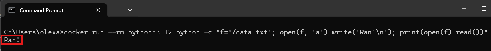
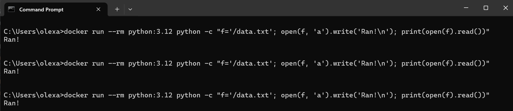
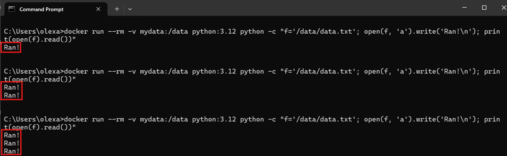
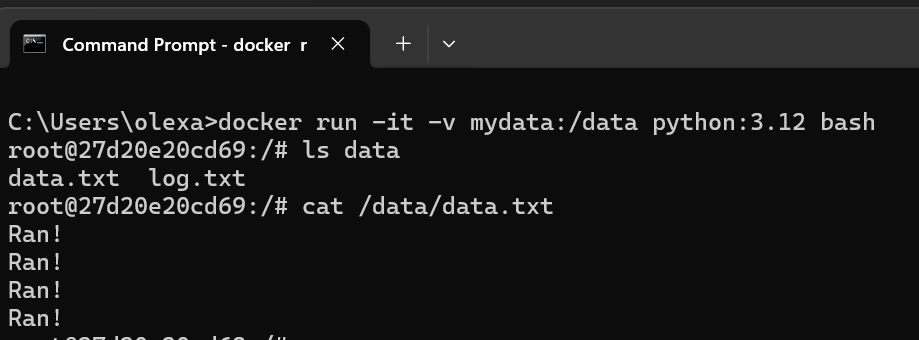
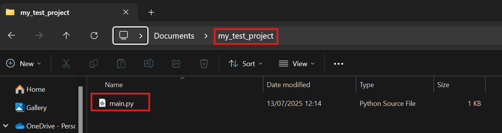
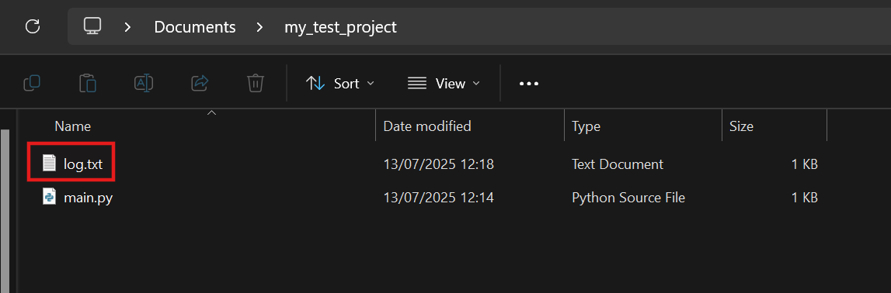
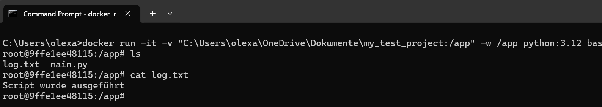

# Datenpersistenz in Docker

Wenn ein Docker-Container gestartet wird, hat er ein eigenes, isoliertes Dateisystem. Dieses Dateisystem basiert auf dem zugehörigen Image und wird jedes Mal beim Start neu erstellt – frisch, sauber, leer. Das bedeutet:

- Alle Daten, die während der Laufzeit des Containers gespeichert werden, gehen beim Stoppen oder Neustarten verloren.

- Ein Webserver-Container vergisst z. B. Log-Dateien, eine Datenbank vergisst alle gespeicherten Datensätze, und Skripte, die Dateien schreiben, starten wieder bei null.

Docker-Container sind standardmäßig flüchtig. Um Daten dauerhaft zu speichern, benötigt es sogenannte Persistenzmechanismen.
<br>
<br>
In der Praxis gibt es kaum Anwendungen, die vollständig ohne dauerhafte Datenspeicherung auskommen. Fast alle Anwendungen generieren Daten zur Laufzeit, die über die Lebensdauer eines Containers hinaus erhalten bleiben müssen.

Betrachten wir folgendes Beispiel: 

- `f = '/data.txt'`: Wir erstellen eine Datei `data.txt` im Wurzelverzeichnis. 

- `open(f, 'a').write('Ran!\n')`: Die Datei `data.txt` wird im Anhängemodus `a` geöffnet – falls sie nicht existiert, wird sie erstellt. Dann wird `Ran! + Zeilenumbruch` angehängt.

- `print(open(f).read())`: Öffnet die Datei im Lesemodus (Standard) und gibt den gesamten Inhalt auf der Konsole aus

Dazu führen wir folgenden Befehl aus:

```
docker run --rm python:3.12 python -c "f='/data.txt'; open(f, 'a').write('Ran!\n'); print(open(f).read())"
```



Aber egal wie oft wir diesen Befehl ausführen, wird immer nur "Ran!" ausgegeben. Die `data.txt` Datei wird also nicht erweitert, weil bei jedem Container-Start alles auf den Ausgangszustand gesetzt wird:



Um diesem Problem zu lösen, bietet Docker eine Lösung. Docker erlaubt es, Verzeichnisse von außen in einen Container "hineinzumounten". Dadurch können Daten auch dann erhalten bleiben, wenn der Container gestoppt oder gelöscht wird. Docker kennt zwei grundlegende Mechanismen, um externen Speicher in Container einzubinden:

| Art         | Beschreibung                                                                                                                                                  |
| ----------- | ------------------------------------------------------------------------------------------------------------------------------------------------------------- |
| Volumes     | Speicherbereiche, die von Docker verwaltet werden. Diese liegen außerhalb des Containers und sind vom Host nicht direkt sichtbar, aber dauerhaft gespeichert. |
| Bind Mounts | Ein Ordner vom Hostsystem (also z.B. dein Computer) wird direkt in den Container eingebunden – z.B. der Projektordner oder eine Konfigurationsdatei.          |

## Volume Mount

Betrachten wir Volume-Mount als erstes. Wir erstellen ein Volume namens `mydata` und mounten es in den Container unter `/data`:

```
docker run --rm -v mydata:/data python:3.12 python -c "f='/data/data.txt'; open(f, 'a').write('Ran!\n'); print(open(f).read())"
```

- Im Container wird die Datei `/data/log.txt` beschrieben.

- Bei jedem neuen Containerlauf bleibt der Inhalt erhalten, weil das Volume persistent ist.

- `mydata` ist der Name eines Docker-Volue

- `/data` ist das Verzeichnis im Container, in das dieses Volume eingebunden wird



Wir könnten nun den Container mit einem interaktiven Terminal starten und nochmal das Volume `mydata` mounten:

```
docker run -it -v mydata:/data python:3.12 bash
```

Nun bekommt man ein Terminal im Container. Hier geben wir ein:

```
ls data
```

Hier müsste die Datei `data.txt` liegen, wir können sie auslesen:

```
cat /data/data.txt
```

Das Kommando `cat` ist die Abkürzung für "concatenate" und wird im Terminal (z.B. in Linux, macOS oder im Docker-Container) verwendet, um den Inhalt einer Datei auf der Konsole anzuzeigen.



Volume-Mount eignet sich hervorragend für persistente Datenbanken oder Cacheverzeichnisse, die unabhängig vom Host sind.

## Bind Mount

Ein Bind Mount ist ideal für die lokale Entwicklung, bei der Dateien vom Host in den Container gespiegelt werden sollen. Es wird also ein Ordner auf dem Host-Rechner mit einem Pfad im Container verknüpft. Der Container greift dann direkt auf diesen Ordner zu.
<br>
<br>
Stellen wir uns vor, im aktuellen Arbeitsverzeichnis `C:\Users\olexa\OneDrive\Dokumente\my_test_project` liegt ein einfaches Python-Skript `main.py`.



Das Skript soll im Container ausgeführt werden, aber die Datei `log.txt` soll lokal im Projektverzeichnis bleiben. Wir starten den Container mit Bind-Mount:

```
docker run --rm -v "C:\Users\olexa\OneDrive\Dokumente\my_test_project:/app" -w /app python:3.12 python main.py
```

- `-v "C:\...:\app"` Das Verzeichnis auf deinem Host (Windows) wird in den Container unter `/app` eingebunden.

- `w /app` Setzt das Arbeitsverzeichnis im Container auf `/app`. Alle Befehle starten dort.

- `python main.py` Führt im Container den Python-Interpreter aus und übergibt ihm das Skript main.py.

Nach Ausführung des Befehls wird:

- eine Datei `log.txt` im Windows-Ordner angelegt (falls nicht vorhanden),

- `Script wurde ausgeführt` hineingeschrieben,



Man kann den Container auch interaktiv starten und sich ansehen, ob der Pfad `/app` korrekt eingebunden ist:

```
docker run -it -v "C:\Users\olexa\OneDrive\Dokumente\my_test_project:/app" -w /app python:3.12 bash
```

Anschließend gibt man ein:

```
ls
cat log.txt
```



Bei einem Bind Mount handelt es sich also um eine direkte Verknüpfung (kein Kopieren!) zwischen einem Ordner auf dem Hostsystem (z.B. ein lokaler Windows-Ordner) und einem Verzeichnis im Container. Alles, was im Container unter `/app` passiert (z.B. Datei schreiben, löschen, editieren), passiert tatsächlich direkt im Host-Verzeichnis. Man kann sich das vorstellen wie einen gemeinsamen Ordner, den zwei Betriebssysteme gleichzeitig verwenden.
<br>
<br>
Betrachten wir folgende Grafik für das Verständnis:


**1. Der Container:**<br>

- Wenn in einem Container z. B. eine Datei geschrieben wird z.B. `log.txt`, ohne Bind Mount oder Volume, dann ist sie nur hier gespeichert – und geht beim Löschen des Containers verloren.

**2. Volumes:**<br>

- Dieser Ort ist perfekt für Produktivdatenbanken, Caches oder Speicherdaten, die z.B. mehrere Container gemeinsam nutzen sollen. 

**3. Bind Mounts:**<br>

- Ebenfalls persistent, aber im Gegensatz zu Volumes ist der Speicherort ein echter Ordner auf dem Host-Rechner.

**4. tmpfs:**<br>

- Wird oft als "temporärer Speicher" verwendet – ist aber nicht persistent. Daten bleiben nur im RAM und gehen beim Stopp verloren. Das ist eher für sensible, flüchtige Daten (z.B. Passwörter) oder Performance-Optimierung geeignet. Darauf sol lerstmal nicht näher eingegangen werden.

