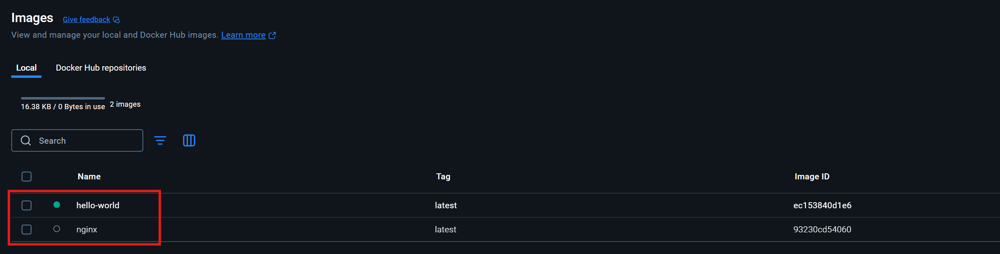
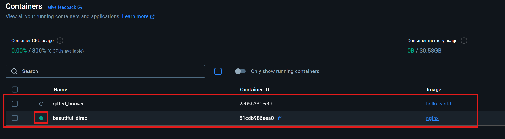
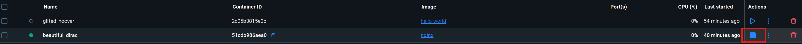
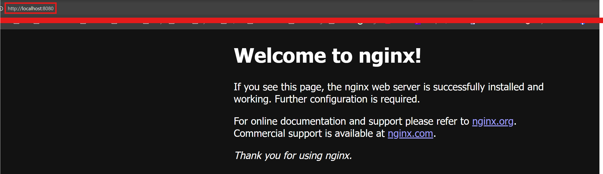

# Port Mapping in Docker

Container sind in Docker standardmäßig isoliert. Das bedeutet: Ein Container startet sein eigenes Netzwerk, kann aber nicht direkt vom Host (z.B. deinem Browser oder Terminal) erreicht werden.
<br>
<br>
Das ist eine Sicherheitsfunktion – aber auch ein Problem, wenn man beispielsweise einen Webserver im Container starten möchte und von außen darauf zugreifen will.

**Was ist Port Mapping?**

Port Mapping bedeutet, dass man einen bestimmten Port innerhalb des Containers mit einem Port auf dem Host-Rechner verbindet. Dadurch wird der Container von außen "sichtbar".
<br>
<br>
Ein Port ist wie eine Tür in einem Computer, über die Daten ein- oder ausgehen können.
Man kann sich einen Computer wie ein großes Haus vorstellen – und jeder Dienst (z.B. ein Webserver, eine Datenbank oder E-Mail) hat seine eigene Tür, durch die er mit der Außenwelt kommuniziert. 
<br>
<br>
In fast allen Fällen betreibt ein Computer mehrere Programme gleichzeitig.
Aber alle Programme verwenden dieselbe IP-Adresse (quasi die Adresse des Hauses).
Ports sorgen dafür, dass klar ist, welches Programm die Daten bekommen soll.
<br>
<br>
Bekannte Ports sind z.B.

| **Port** | **Verwendung**            |
| -------- | ------------------------- |
| 80       | Webseiten (HTTP)          |
| 443      | Sichere Webseiten (HTTPS) |
| 22       | Fernzugriff über SSH      |
| 3306     | MySQL-Datenbank           |
| 6379     | Redis-Datenbank           |

## 1. Beispiel am nginx-Webderver

Nehmen wir an, man möchte eine einfache Webseite mit nginx im Container anzeigen lassen. Als erstes hollen wir uns das jeweilige Docker Image:

```
docker pull nginx
```

Nun haben wir zwei Docker Images:



Wir erstellen einen neuen Container, mithilfe dieses Images. Dabei wird der `nginx`-Server im Container gestartet:

```
docker run nginx
```

Im Docker Desktop, sind nun zwei Container vorhanden. Man achte auf den grünen Punkt beim neuen `nginx`-Container, er bedeutet, dass der Container momentan ausgeführt wird. 



Wenn man nun im Browser http://localhost aufruft passiert nichts. Der nginx-Server läuft innerhalb des Containers, und zwar auf Port 80. Aber dieser Port ist nur im Container sichtbar – nicht auf unseren Host-System. Deswegen kann der Browser auf unseren Rechner (also dem Host) diesen Port nicht erreichen, solange man nicht explizit sagt: "Gib diesen Port nach außen frei!"
<br>
<br>
Mithilfe von Port Mapping, kann man dieser Problem beseitigen. Wir können den Port des Container mit einem Port des Hosts verbinden. Dazu stoppen wir erstmal den Container durch `STRG + C` oder im Docker Desktop durch das "Stop"-Icon:



Wir führen nun nochmal den `run`-Befehl aus, jedoch verwenden wir den `-p`-Flag:

```
docker run -p 8080:80 nginx
```

Durch diesen Flag, wird der Port 80 im Container (da läuft ja nginx drauf) mit dem Port 8080 des Hosts (unser Rechner) verbunden.
<br>
<br>
Jetzt kann man im Browser http://localhost:8080 aufrufen und die Standardseite von dem `nginx`-Server wird angezeigt.



Wenn jemand dem Host auf Port 8080 anspricht, wird er intern weitergeleitet an den Container auf Port 80.

