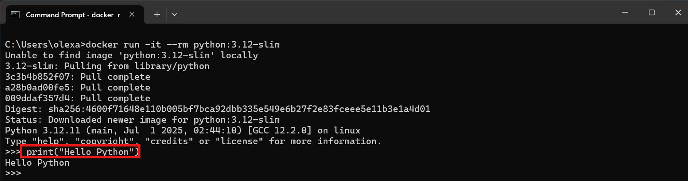
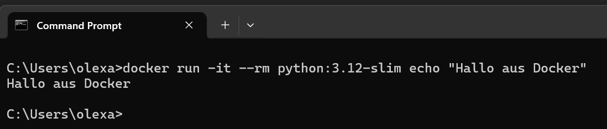
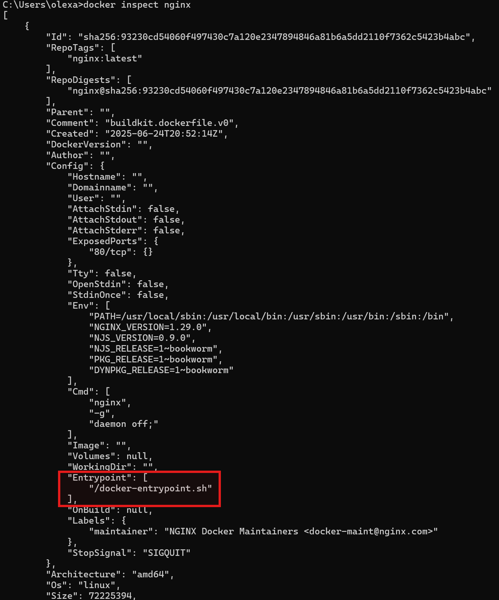
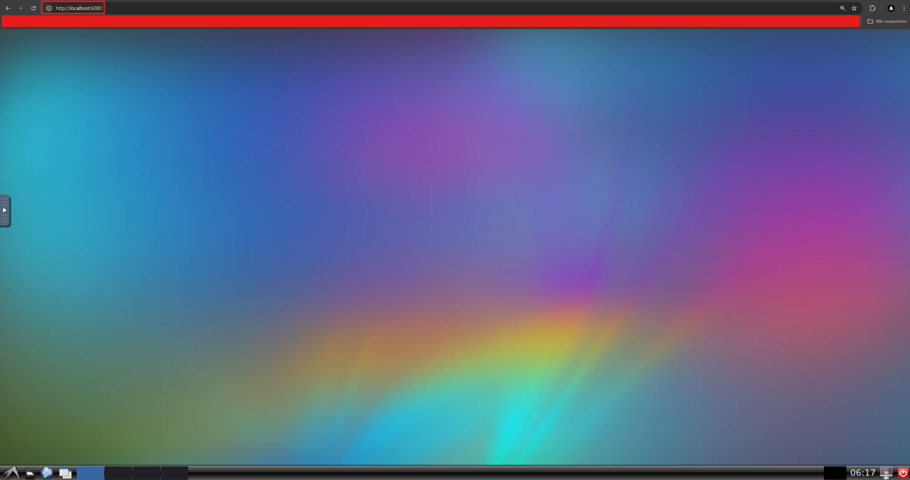
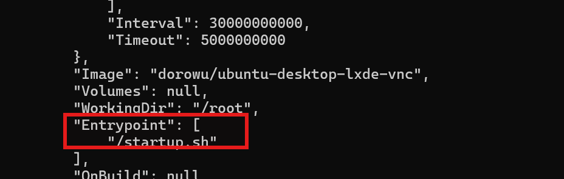

# Docker Runtimes

Wenn man Container mit Docker ausführt, stellt sich irgendwann die Fragen: 

- Was passiert im Container überhaupt beim Start?

- Wie wird eigentlich festgelegt, welches Programm gestartet wird?

Hier kommt das Konzept der Runtime ins Spiel – also der Ablaufumgebung, die bestimmt, was beim Start eines Containers ausgeführt wird. Runtimes bezeichnet also die Befehle, die beim Start eines Containers ausgeführt werden, um einen laufenden Prozess zu erzeigen wie z.B. einen Webserver, eine Datenbank oder eine Python Anwendung.
<br>
<br>
Diese Runtime-Konfiguration wird in der Dockerfile festgelegt und kann durch Direktiven gesteuert werden. Eine Direktive in einer Dockerfile ist eine Anweisung, die Docker beim Bauen des Images mitteilt, was zu tun ist. Man kann sich das vorstellen wie eine Rezeptzeile in einer Kochanleitung:

- Sie sagt Docker ganz genau, welcher Schritt als Nächstes ausgeführt werden soll – zum Beispiel:

  - Welche Basis verwendet wird (`FROM`)

  - Welche Dateien kopiert werden sollen (`COPY`)

  - Welcher Befehl beim Start des Containers ausgeführt werden soll (`CMD` oder `ENTRYPOINT`)


Die beiden Direktiven `CMD` und `ENTRYPOINT` geben an, welcher Befehl innerhalb des Containers automatisch gestartet werden soll, wenn `docker run...` ausgeführt wird.

## Die Standardausführung `CMD`

Die `CMD`-Direktive legt einen Standardbefehl und ggf. Argumente fest, die beim Start des Containers ausgeführt werden sollen – aber nur dann, wenn beim Aufruf von `docker run` keine anderen Befehle angegeben werden.
<br>
<br>
Ein gutes Beispiel ist das offizielle Python-Image, z.B. `python:3.12-slim`. Dieses Image enthält in der Dockerfile bereits eine CMD-Anweisung:

```
CMD ["python3"]
```

Man kann den Docker File von `python:3.12-slim` unter dem folgenden Link erkunden: https://github.com/docker-library/python/blob/a25c9ad64fe168fb619fea7247b17189d441b988/3.12/slim-bookworm/Dockerfile. Vieles davon wird man erstmal nicht verstehen, für uns ist nur wichtig dass da `CMD ["python3"]` vorkommt.
<br>
<br>

Dabei bedeutet `CMD ["python3"]` dass wenn kein anderer Befehl beim Starten des Containers angegeben wird, dann wird standardmäßig python3 ausgeführt. Wir sollten also sofort in der Lage sein Python code im Terminal schreiben zu können. Wir testen das ganze mit den folgenden Befehl:

```
docker run -it --rm python:3.12-slim
```

- `docker run ...` sagt: Starte einen Container aus diesem Image

- `it` bedeutet: Mach das Terminal interaktiv, damit man tippen kann

- `--rm heißt`: Lösche den Container nach dem Beenden automatisch

- `python:3.12-slim` ist das Image

Es wird kein weiterer Befehl angegeben, daher greift die CMD ["python3"]-Anweisung.



Was passiert, wenn man einen eigenen Befehl übergibt? Nehmen wir z.B.

```
docker run -it --rm python:3.12-slim echo "Hallo aus Docker"
```

Das Image ist wieder `python:3.12-slim` aber diesmal überschreiben wir die CMD-Anweisung im Docker-File! Docker führt stattdessen den Befehl `echo "Hallo aus Docker"` im Container aus, danach wird der Container beendet und gelöscht:



| Befehl                                            | Verhalten                                                    |
| ------------------------------------------------- | ------------------------------------------------------------ |
| `docker run -it --rm python:3.12-slim`            | Startet Python-Interpreter (wegen `CMD ["python3"]`)         |
| `docker run -it --rm python:3.12-slim echo Hallo` | Startet nicht Python, sondern führt `echo Hallo` aus         |
| `docker run -it --rm nginx`                       | Startet den Webserver `nginx` (weil das dort in `CMD` steht) |

Dieses Wissen ist wichtig um:

- zu wissen was läuft im Container, sobald er gestartet wird?

- zu verstehen wie man dieses Verhalten beeinflussen oder überschreiben kann?

- eigene Images zu entiwckeln

## ENTRYPOINT – Unveränderlich beim Start

Die ENTRYPOINT-Direktive legt fest, welcher Befehl immer beim Start des Containers ausgeführt wird – egal, ob beim `docker run` zusätzliche Befehle angegeben wurden oder nicht. Man kann sich das wie ein fester Startpunkt vorstellen. Im Gegensatz zu CMD wird ENTRYPOINT nicht automatisch ersetzt, sondern:

- Der Befehl beim `docker run` wird als Argument an ENTRYPOINT angehängt.

Ein sehr gutes Beispiel ist das offizielle `nginx-Image`. Man kann es wie folgt untersuchen:

```
docker inspect nginx
```

In der Ausgabe findet man unter `Entrypoint` den Eintrag: `"/docker-entrypoint.sh"`



Der ENTRYPOINT ist das Shell-Skript `/docker-entrypoint.sh`. Es wird immer ausgeführt, sobald ein Container aus diesem Image gestartet wird.
Der CMD enthält den Standardbefehl `nginx -g 'daemon off;'`, also den Start des Webservers im Vordergrund-Modus (daemon off = bleibe im Vordergrund, wichtig für Docker).

**Szenario 1: Container ganz normal starten:**

Durch 

```
docker run --rm nginx
```

kombiniert Docker automatisch ENTRYPOINT und CMD. Intern führt Docker folgendes aus:

```
/docker-entrypoint.sh nginx -g 'daemon off;'
```

**Szenario 2: Eigenen Befehl übergeben:**

```
docker run --rm nginx echo "Hallo ENTRYPOINT"
```

Hier sieht man deutlich den Unterschied zu CMD:

- Das ENTRYPOINT-Skript bleibt erhalten.

- Der neue Befehl echo ersetzt nicht das ENTRYPOINT, sondern wird als Argument an das Skript übergeben.

##  Ubuntu-Desktop in Docker mit grafischer Oberfläch

Wenn man mit Docker arbeitet, sind die meisten Container rein textbasiert – man arbeitet also über die Kommandozeile, z.B. mit `bash`, `sh`, `python`, usw. Aber was, wenn man einmal eine grafische Benutzeroberfläche (GUI) sehen möchte – wie man es von einem normalen Desktop-Betriebssystem kennt?
<br>
<br>
Wir laden als erstes ein spezielles Ubunto-Image. Dieses Image basiert auf Ubuntu und bringt eine vollständige grafische Desktop-Oberfläche (LXDE) mit, die per VNC über den Browser erreichbar gemacht wird:

```
dorowu/ubuntu-desktop-lxde-vnc
```

Wir starten den Container:

```
docker run -d -p 6080:80 --name ubuntu-desktop dorowu/ubuntu-desktop-lxde-vnc
```

Sobald der Container läuft, kann man im Browser folgende Adresse aufrufen:

```
http://localhost:6080
```

Nun erscheint eine vollständige grafische Desktop-Oberfläche von Ubuntu:



ie grafische Oberfläche läuft komplett im Container, und der Browser stellt nur die Benutzeroberfläche dar – ganz ohne zusätzliche Software auf dem Host. Die Anwendungsmöglichkeiten sind sehr vielfältig:

- Für Lernzwecke, um Ubuntu grafisch zu erkunden

- Zum Testen von GUI-Tools unter Linux

- Um grafische Entwicklungsumgebungen (z. B. VSCode, Gedit) auszuführen

Das Image `dorowu/ubuntu-desktop-lxde-vnc` verwendet einen ENTRYPOINT, der den VNC-Server und die grafische Umgebung startet. Dieser ENTRYPOINT bleibt wie wir bereits kennen gelernt haben immer aktiv, auch wenn man über ein CMD versucht, etwas anderes auszuführen.

Wir könnne über `docker inspect ubuntu-desktop dorowu/ubuntu-desktop-lxde-vnc` den ENTRYPOINT untersuchen. Dabei findet man den folgenden Eintrag:



Das bedeutet: Bei jedem Start wird `/startup.sh` ausgeführt – das Skript startet den grafischen Desktop.

## Fazit

Die Kombination von ENTRYPOINT + CMD erlaubt es, das Containerverhalten intelligent zu steuern:

| Kombination                        | Wirkung                                           |
| ---------------------------------- | ------------------------------------------------- |
| `ENTRYPOINT` fest + `CMD` flexibel | Standardverhalten, aber bei Bedarf anpassbar      |
| Nur `CMD`                          | Leicht zu überschreiben, weniger Kontrolle        |
| Nur `ENTRYPOINT`                   | Fixes Verhalten, keine flexible Argumente möglich |
| Beide kombiniert                   | Maximale Flexibilität mit festem Einstiegspunkt   |

Das ist besonders hilfreich bei Containern, die:

- beim Start Setups oder Prüfungen durchführen müssen,

- unterschiedliche Modi (z.B. Test, Debug, Produktion) starten sollen,

- oder eine eigene Befehlssprache anbieten.

Als Merksatz kann man aus dem Kapitel folgendes mitnehmen:

- ENTRYPOINT = Was immer ausgeführt wird

- CMD = Was standardmäßig übergeben wird (optional)

