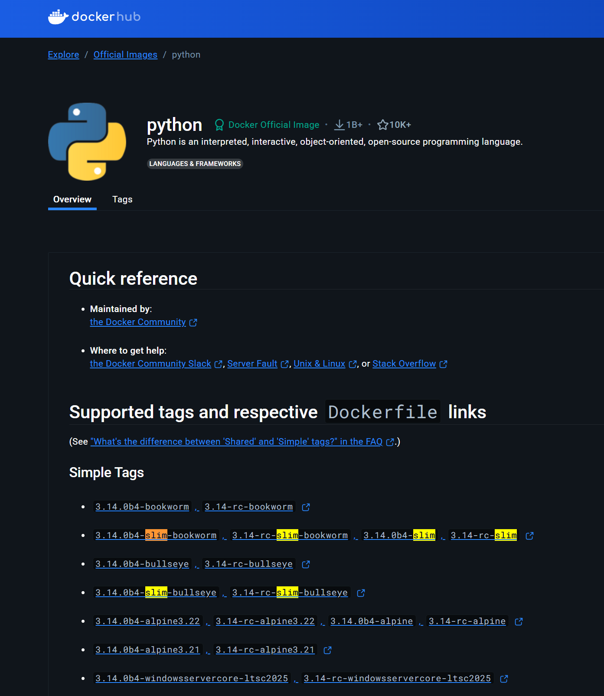
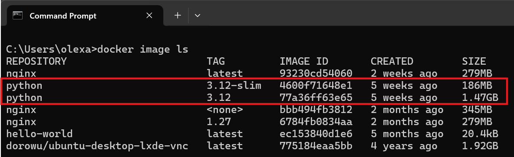
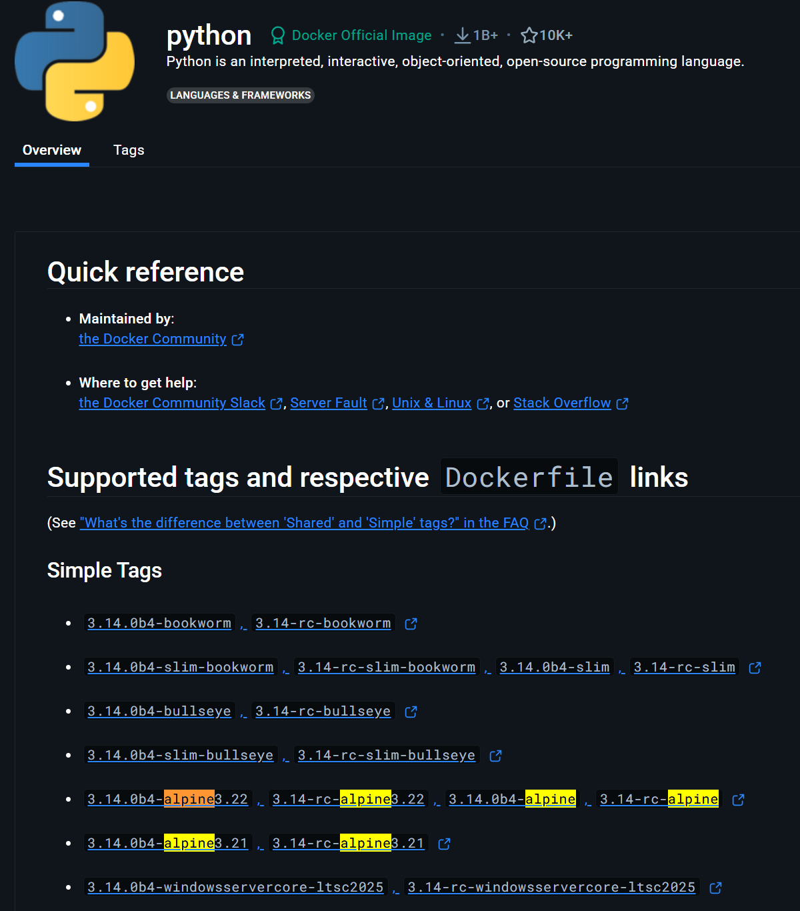
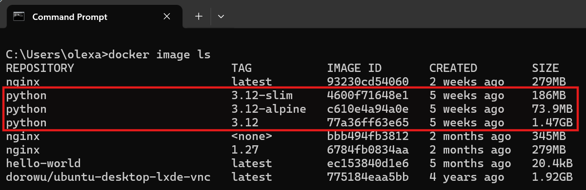

# Slim- und Alpine-Images: Kleine, schnelle Docker-Container

Wenn man Docker-Container erstellt oder verwendet, stößt man schnell auf ein zentrales Thema: die Größe der Docker-Images. Ein typisches Image wie z.B. python kann über 1 GB groß sein. Das bedeutet:

- Langes Herunterladen

- Längeres Starten

- Höherer Speicherbedarf

- Mehr Daten, die über das Netzwerk übertragen werden müssen (z.B. beim Deployment)

In vielen Fällen braucht man aber gar nicht das komplette Betriebssystem oder eine voll ausgestattete Entwicklungsumgebung. Für viele Anwendungen reichen minimale Laufzeitumgebungen völlig aus – und genau dafür gibt es Slim- und Alpine-Images.

## Was sind Slim-Images?

Slim-Images sind speziell optimierte Versionen von Basis-Images wie `python`, `node`, `debian` oder `ubuntu`.
Sie enthalten nur die notwendigsten Bestandteile des Betriebssystems und der Umgebung, um eine bestimmte Anwendung auszuführen.



Das Docker Image welches Python in Version 3.13 enthält basiert auf einem vollständigen Debian/Linux-System. Es enthält

- Die offizielle Version von Python

- Systembibliotheken, also alles notwendige damit Python funktioniert

- Den Paketmanager `apt` um weitere Tools wie z.B. Git zu installieren

- Die Shell als interaktive Kommandozeile im Container

- Außerdem grundlegende Tools wie z.B. `pip`, `ls`, `echo` und mehr

Man kann sich dieses Image als eine kleine virtuelle Linux-Maschine vorstellen, welches alles was man zur Python-Programmierung benötigt, enthält. Wir laden als erstes dieses Image herunter:

```
docker pull python:3.12
```

Nun hat man auch die Möglichkeit eine "verschlankte" Variante des offiziellen Python-Images herunterzuladen. Es entält ebenfalls die Python 3.12 Version, basiert auf Debian, welches allerdings eine stark reduzierte Version ist. Bei dem Debian-System wurden viele nicht benötigte Pakete und Tools entfernt. Ziel ist es das Image so klein wie möglich zu machen, aber Python trotzdem vollständig lauffähig zu halten.
<br>
<br>
Wir laden nun diese "verschlankte" Version herunter:

```
docker pull python:3.12-slim
```

Nun können wir die Speicherkapizität vergleichen:

```
docker image ls
```



Man sieht deutlich, dass die `slim`-Variante, etwa um den Faktor 10 kleiner ist.

Beide Image Varianten haben ihre Vor- und Nachteile. Die `slim`-Variante hat:

- Weniger vorinstallierte Tools, Tools wie z.B. `curl`, `git` sind nicht enthalten.

- Fehlende Systembibliotheken, welche für manche Python-Module benötigt werdem

- Weniger Tools für das Debugging

Solche `slim`-Varianten verwendet man für Produktivumgebungen, bei denen jede Megabyte zählt. In der Cloud kosten Speicherplatz, Netzwerkverkehr und Startzeiten Geld. Je kleiner ein Container-Image ist, desto weniger Daten müssen über das Netz (z.B. AWS, Azure, GCP) übertragen werden. In modernen Softwareprojekten wird Code ständig automatisch getestet, gebaut und ausgeliefert mit sogenannten CI/CD-Pipelines. Dabei müssen Container schnell starten und die Zeiten minimal halten, um die Pipeline nicht zu verzögern. In einer GitHub Actions Pipeline wird bei jedem Commit ein neuer Container gebaut und getestet. Ein kleineres Basis-Image bedeutet schnelleres Feedback für Entwickler und weniger Rechenkosten.

## Was sind Alpine-Images?

Alpine Linux ist eine speziell entwickelte, extrem schlanke Linux-Distribution, die für Sicherheit, Minimalismus und Größe optimiert wurde. Die gesamte Grundinstallation ist nur ca. 50 MB groß – verglichen mit hunderten Megabytes bei traditionellen Distributionen wie Debian oder Ubuntu.
<br>
<br>
Docker bietet viele offizielle Images auf Basis von Alpine an, z.B.:

- python:3.12-alpine

- node:20-alpine

- nginx:alpine



Diese Images sind ebenfalls so konzipiert, dass sie nur das Nötigste enthalten, was ein Container zum Starten braucht. Alpine ist nicht nur "klein" – es ist auch fundamental anders aufgebaut als die meisten bekannten Linux-Distributionen wie z.B. Debian, auf denen die meisten Docker-Images (z.B. slim) basieren.
<br>
<br>
Diese Unterschiede betreffen wichtige Systemkomponenten wie die C-Bibliothek, die Shell oder den Paketmanager – und genau das kann bei der Entwicklung oder Verwendung von Software zu Problemen führen. Die Entscheidung für Alpine bedeutet: Man arbeitet nicht mit einem typischen Linux, wie man es von Servern, Cloud-Umgebungen oder dem eigenen Rechner kennt. Alpine verwendet z.B. ash, eine reduzierte Version der Shell, die deutlich weniger Features hat als bash. Viele Skripte, die unter bash funktionieren, scheitern in Alpine.
<br>
<br>
Wie laden uns mal das `alpine`-Image von Python:

```
docker pull python:3.12-alpine
```

Und vergleichen nochmals die Speicherkapazität:

```
docker images ls
```



Die `alpine`-Images werden verwendet wenn:

- Das kleinste Image was es gibt benötigt wird für z.B. produktiv-Anwendungen (häufig in der Cloud).

- Wenn man die Angriffsfläche minimieren möchte. Durch die wenigen Tools sind weniger potenzielle Sicherheitslücken vorhanden.

- Die Container nur wenige Abhängigkeiten benötigen, z.B. nur einfache `curl`-Befehle

- Die `alpine`-Images laden und starten am schnellsten, ideal für Pipelines

Man sollte aber immer beachten, das mehr Aufwand bei der Konfiguration der `alpine`-Images betrieben wird. Oft muss man bestimmte Tools nachinstallieren und bestimmte passende Pakete für sein Vorhaben finden. Wenn man also schnell los legen möchte sollte man `slim`-Images verwenden. Wenn es jedoch sehr minimal sein soll, verwendet mal `alpine`-Images.

