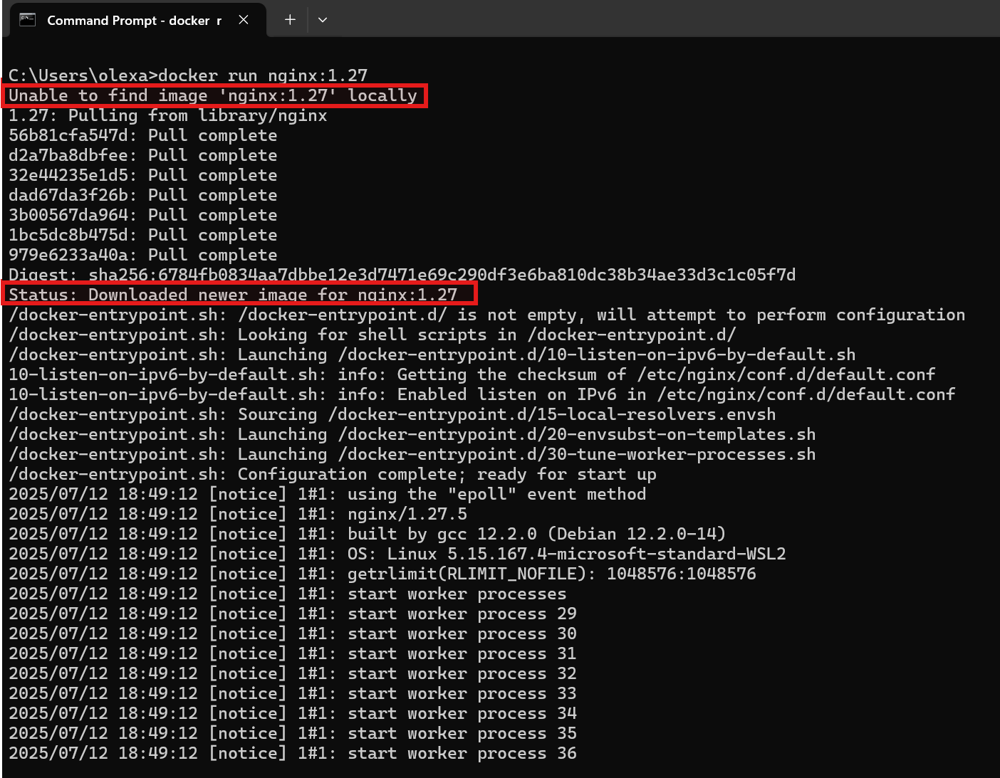
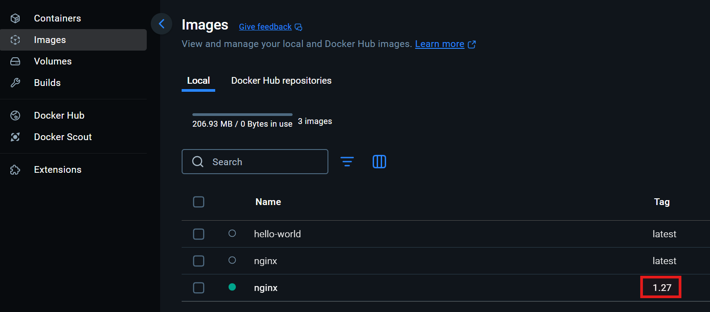
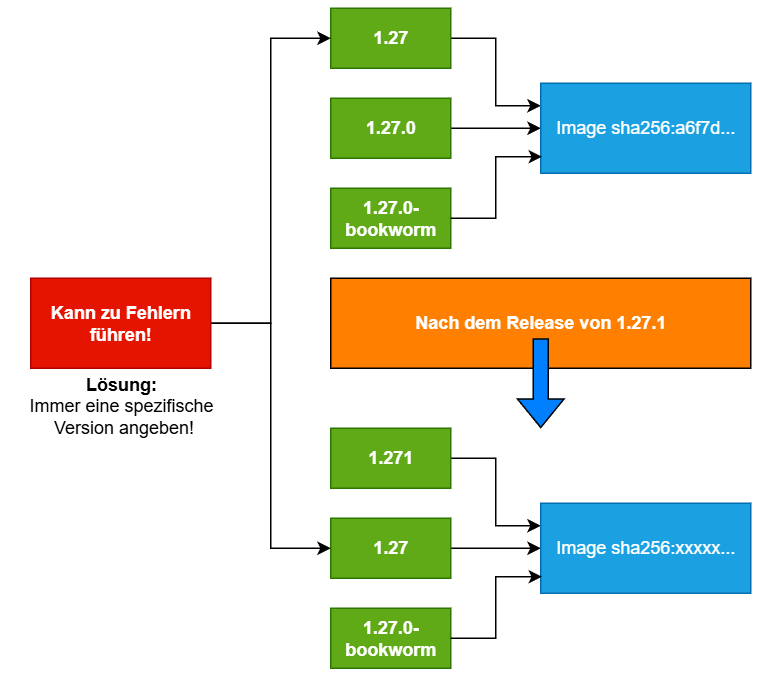
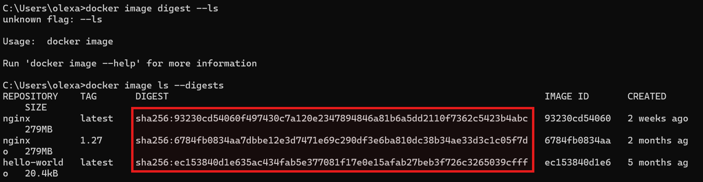
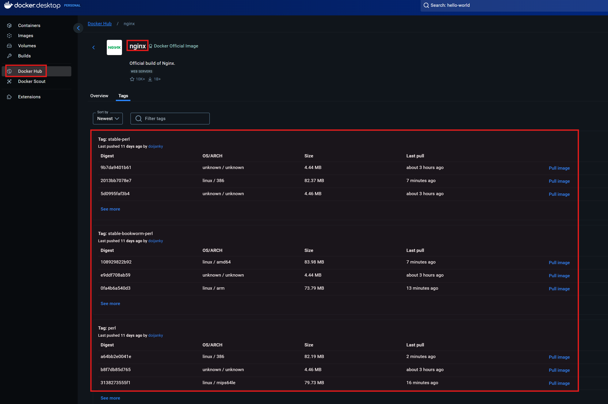
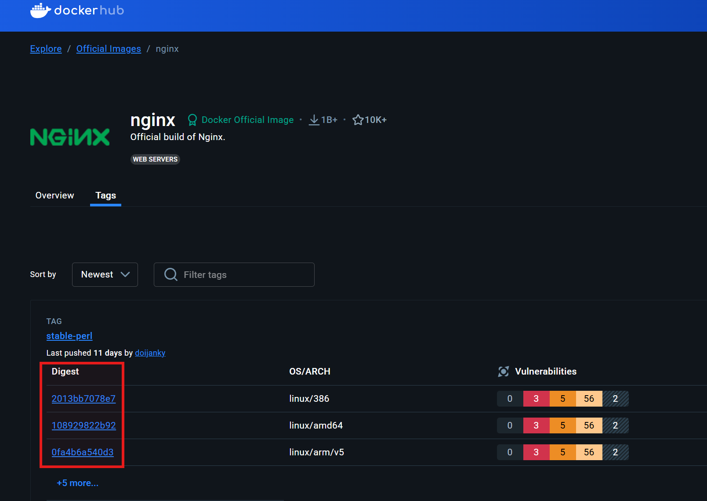
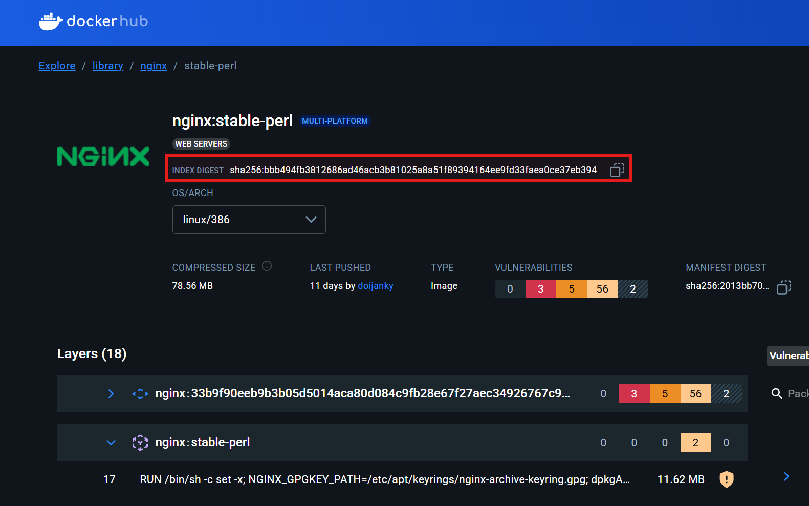
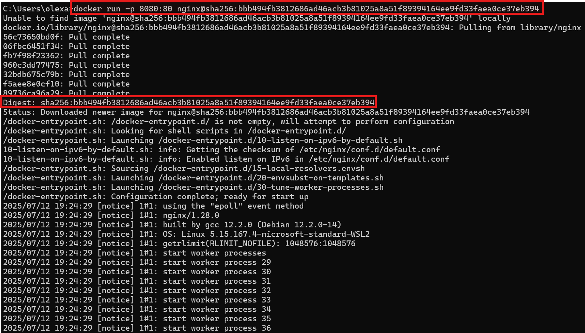

# Tagging von Docker-Images

Wenn man mit Docker arbeitet, kommt man sehr schnell mit dem Konzept der Tags in Berührung. Ein Tag ist im Kontext von Docker eine Bezeichnung (ein Label), die einer bestimmten Version eines Docker-Images zugewiesen wird. Man kann es sich vorstellen wie ein Versionsstempel, z.B. `nginx:1.27`. Die Syntax allgemein formuliert, lautet:

```
repository:tag
```

Jedes Mal, wenn der Befehl `docker run nginx` ausgeführt wurde, verwendete Docker entweder die neueste verfügbare Version des Images oder griff auf eine bereits lokal vorhandene Version zurück. Wenn wir nun den Tag verwenden, können wir eine bestimmte Version des Docker-Images verwenden:

```
docker run nginx:1.27
```



Auch in Docker Desktop wird diese Version unter "Images" angezeigt:



**Vorsicht beim Verwenden von `latest`:**

Wenn man mit Docker arbeitet und z.B. den Befehl `docker run nginx` ausführt, ohne eine bestimmte Version anzugeben, wird standardmäßig das Image mit dem Tag `latest` verwendet. Auf den ersten Blick klingt das bequem: Man erhält scheinbar immer die "aktuellste" Version. Doch genau hier liegt ein verbreitetes Missverständnis und eine potenzielle Fehlerquelle – vor allem in produktiven Umgebungen.
<br>
<br>

Der Tag `latest` ist kein technisches Konzept, das automatisch immer auf die neueste verfügbare Version eines Images zeigt. Stattdessen ist `latest` ein ganz normaler Tag-Name, der von den Image-Autoren (bzw. vom Team, das die Images verwaltet) manuell vergeben wird – genau wie jeder andere Tag, z.B. `1.27.0`, `alpine`, `slim` oder `python3.12`.
<br>
<br>

Man kann sich das wie ein Symbolischen Link (alias) vorstellen, der auf ein bestimmtes Image verweist. Das bedeutet aber auch: Der Inhalt hinter dem Tag `latest` kann sich jederzeit ändern!
<br>
<br>

Angenommen, heute zeigt `nginx:latest` auf die Version `1.27.0`. Das heißt, wenn man das Image jetzt mit `docker pull nginx` lädt, erhält man genau diese Version. Einige Tage später veröffentlichen die Maintainer jedoch die Version `1.28.0` und aktualisieren den `latest`-Tag, sodass dieser nun auf `1.28.0` zeigt. Wenn man nun erneut `docker pull nginx` ausführt oder ein neues Image baut, das auf `nginx:latest` basiert, erhält man eine andere Version als zuvor – ohne es vielleicht zu merken.



Wenn sich die Version eines Images stillschweigend ändert, kann das:

- zu unterschiedlichem Verhalten der Anwendung führen,

- Fehler verursachen, die sich schwer debuggen lassen,

- oder im schlimmsten Fall sogar den Betrieb stören.

Statt `latest` zu verwenden, sollte man in der Praxis immer eine explizite, feste Version angeben, z.B.:

```
docker run nginx:1.27.0-bookworm
```

**Der Digest-Pinning:**

In Docker werden Images in sogenannten Image-Registries gespeichert (z.B. Docker Hub):


Beim Herunterladen eines Images – etwa mit `docker pull nginx:1.27` – lädt Docker ein bestimmtes Image aus dieser Registry. Dieser Zugriff erfolgt standardmäßig über einen Tag wie `1.27`, `latest` oder `alpine`. Wir haben gesehen das ein Tag veränderbar ist. Ein Tag wie `nginx:1.27` kann heute auf ein bestimmtes Image in der Registry zeigen und morgen auf ein anderes.
<br>
<br>
Wenn man jedoch ein Image über seinen Digest anfordert, verwendet Docker eine exakte, nicht veränderbare Version des Images. Ein Digest ist ein SHA256-Hash, der den vollständigen Zustand eines Images beschreibt. Solche Hashes garantieren, dass der Inhalt des Images exakt derselbe bleibt – selbst über Jahre hinweg.
<br>
<br>
Um den Digest (SHA256-Hash) eines bereits heruntergeladenen Images anzuzeigen, kann man folgenden Befehl verwenden:

```
docker image ls --digests
```



Man kann sich auch einen guten Überblick über die Digests, auf der UI von Docker Desktop bzw. Docker Hub, verschaffen:



Im Web-Browser kann durch den Link https://hub.docker.com/_/nginx/tags die `ngnix`-Seite auf Dockerhub aufrufen. Da hat man die Möglichkeit auf die angezeigten Zahlen, bei der "Digest" Spalte, anzuklicken:



Dann kann man sich die exakte Digest des jeweiligen Images ansehen und falls notwendig kopieren:



Nun kann man die exakte Version des Images downloaden, indem man die Digest angibt. Wie bereits gesagt, der Tag kann plötzlich auf ein anderes Image zeigen, die Digest jedoch nicht:

```
docker run -p 8080:80 nginx@sha256:bbb494fb3812686ad46acb3b81025a8a51f89394164ee9fd33faea0ce37eb394
```



## Fazit

Beim Arbeiten mit Docker-Images sind Tags ein zentrales Werkzeug, um die gewünschte Version eines Images zu bestimmen. Doch hinter ihrer scheinbaren Einfachheit verbergen sich wichtige Überlegungen:

- `latest` ist kein verlässlicher Zeiger auf die "neueste" Version – es ist nur ein Name, der sich jederzeit ändern kann.

- Feste Versionstags wie `nginx:1.27.0` sorgen für mehr Stabilität, da sie gezielt auf bestimmte Releases zeigen.

- Digest-Pinning (@sha256:...) ist die zuverlässigste Methode, um ein Image eindeutig zu referenzieren. So wird sichergestellt, dass in Entwicklung, Test und Produktion exakt das gleiche Image verwendet wird – selbst wenn sich Tags oder Inhalte auf dem Registry-Server ändern.

In produktiven Umgebungen ist es daher unerlässlich, auf Digest-Pinning zu setzen oder zumindest exakt versionierte Tags zu verwenden. Dies schützt vor unerwarteten Änderungen und sorgt für konsistente, reproduzierbare Builds.

