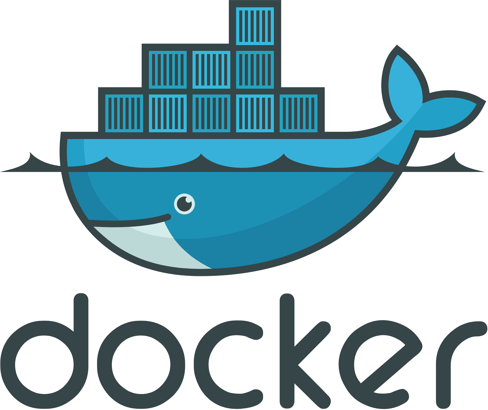

---
hide:

  - navigation

  - toc
---

# Docker Schulung

- [ :material-docker: Einführung in Docker ](content/intro_docker.md)

- [ :material-microsoft-windows: Installation auf Windows ](content/docker_windows_installation.md)

- [ :material-cube-outline: Container vs. Images ](content/containers_vs_images.md)

- [ :material-lan: Port Mapping in Docker ](content/port_mapping.md)

- [ :material-play-circle-outline: Container im Hintergrund ausführen ](content/container_background_run.md)

- [ :material-file-edit: Containerinhalt live bearbeiten ](content/container_webinhalt_bearbeiten.md)

- [ :material-tag-outline: Tagging von Docker-Images ](content/tagging.md)

- [ :material-clipboard-check-outline: Übung ](content/uebung_1.md)

- [ :material-engine-outline: Docker Runtimes ](content/runtimes.md)

- [ :material-pine-tree: Slim- und Alpine-Images ](content/slim_alpine_images.md)

- [ :material-database-outline: Datenpersistenz in Docker ](content/persistence.md)

- [ :material-hammer-wrench: Eigene Docker-Images erstellen - Einstieg ](content/custom_images.md)

- [ :simple-render: Hosting ](content/host.md)

- [ :material-layers-outline: Docker Layers ](content/layers.md)

- [ :material-hammer-screwdriver: Eigene Docker-Images erstellen - Erweitert ](content/custom_images_01.md)
- [ :material-view-compact: Docker Compose](content/compose.md)

- [ :material-microsoft-visual-studio-code: Devcontainer](content/devcontainer.md)

<!-- [:fontawesome-solid-external-link: Zur Lernzielkontrolle](https://forms.office.com/e/B03M460RmA){ target=_blank rel="noopener noreferrer" .md-button .md-button--primary} -->

{{ youtube_video("https://www.youtube.com/embed/b0HMimUb4f0?si=4aHVLdAo3sJhFFfx", expanded=True) }}

